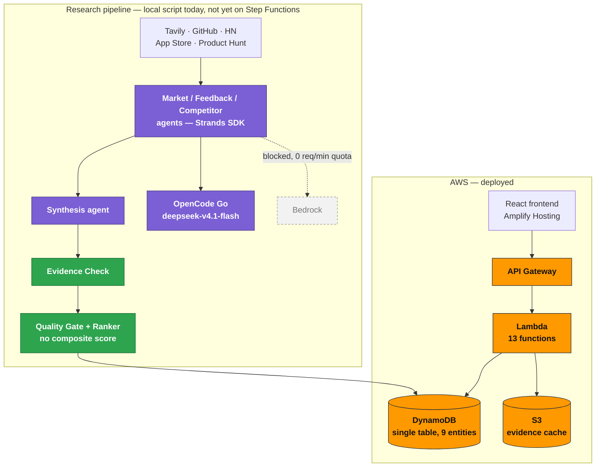

# BusyFox — Opportunity Engine

<p>
  
  
  
  
</p>

Built in four days for **First Commit** (WeMakeDevs × AWS, Bharat Builds Tour), Sept 17–20, 2026.

> **Opportunity Engine finds where a competitor's customers are unhappy about something the
> business is already good at, backs that claim with evidence code can verify, estimates what
> it's worth against the owner's stated goal, and hands the owner an execution pack they
> control.**
>
> Research agents only ever propose `signals[]`. A deterministic Evidence Check and Quality
> Gate — not another LLM call — decide what's allowed into the inbox. **Agents discover. Code
> verifies. Humans decide.**

**Live app:** [main.dw3gwg5t169l9.amplifyapp.com](https://main.dw3gwg5t169l9.amplifyapp.com/)
— walk it in order: `#/business` → `#/investigation` → `#/inbox` → an opportunity card →
`.../execution-pack`.

Full product spec: [`opportunity_engine_prd_v8.md`](opportunity_engine_prd_v8.md).

---

## At a glance

| | |
|---|---|
| **Flagship business** | PulseStack — simulated B2B SaaS (lightweight monitoring), competing against real named tools (Sentry, Datadog, …) |
| **Frontend** | React on Amplify Hosting — five screens: business, live investigation, inbox, opportunity detail, execution pack |
| **Backend** | API Gateway → 13 Lambda functions → DynamoDB (single table) + S3 |
| **Agents** | Strands Agents SDK; Market / Feedback / Competitor research agents, Synthesis, Action — running on OpenCode Go (see [Tools we used](#tools-we-used)) |
| **Data sources** | Tavily, GitHub REST, HN Algolia, App Store RSS, Product Hunt — every response labelled Live → Cached → Demo Fixture, never silently substituted |

## Architecture



Green = deterministic checks, no LLM in the decision. Purple = where a model is actually called
— that's OpenCode Go today, not Bedrock (grey/dashed): Bedrock is IAM-wired and access-approved,
but every AWS account hit a 0 req/min real-time inference quota, so the model call itself was
swapped same-day without touching the surrounding agent architecture. The research pipeline
(agents → Evidence Check → Quality Gate) runs today via a local script writing to the same live
DynamoDB table the API reads from — it isn't wired into Step Functions yet (see
[Future scope](#future-scope)). Full detail, including both drift notes spoken out for the demo
video: [`docs/architecture-diagram.md`](docs/architecture-diagram.md).

## Submission docs

| Doc | What's in it |
|---|---|
| [`WRITEUP.md`](WRITEUP.md) | Problem, build, AWS integration, AI tools used |
| [`CREDITS.md`](CREDITS.md) | Third-party licences and the simulated-vs-real data policy |
| [`LEARNING.md`](LEARNING.md) | Daily learning log, kept since Day 1 |
| [`docs/architecture-diagram.md`](docs/architecture-diagram.md) | What's actually deployed — drift from plan labelled honestly, not glossed over |
| [`docs/contract.md`](docs/contract.md) | Entity + API contract (human-readable mirror of the code) |

## Tools we used

Built with **Claude Code**, driven from a committed task list (`tasks/plan.md`, `tasks/todo.md`)
and repo instructions (`CLAUDE.md`, `AGENTS.md`) so every session picked up the same contract and
guardrails.

The deployed product's agent pipeline runs on **OpenCode Go** (`deepseek-v4.1-flash`),
substituting for the originally-planned Amazon Bedrock calls after every AWS account hit a
0 req/min real-time inference quota — the reasoning architecture didn't change, only which model
answers the call. Full story: [`WRITEUP.md`](WRITEUP.md), [`LEARNING.md`](LEARNING.md).

## Live deployments

| What | URL | Region |
|---|---|---|
| Frontend (Amplify Hosting, app `dw3gwg5t169l9`, branch `main`) | https://main.dw3gwg5t169l9.amplifyapp.com/ | eu-north-1 |
| API Gateway (stack `opportunity-engine-skeleton`) | https://vx59qs2osl.execute-api.eu-north-1.amazonaws.com/ | eu-north-1 |

The Amplify app is git-connected to `main` with auto-build enabled, so every push to `main`
redeploys the frontend from `amplify.yml`. `VITE_API_BASE_URL` is set as an Amplify app-level
environment variable (`https://vx59qs2osl.execute-api.eu-north-1.amazonaws.com`, no trailing
slash) — the deployed frontend hits the live API and only falls back to `DEMO FIXTURE` on a real
failure, never silently.

> Changing that value requires a manual redeploy of the branch (Amplify Console → Hosting →
> `main` → latest job → Redeploy this version) — a new env var alone does not trigger a build.

## Deploy the backend skeleton

`scripts/task6-deploy-wizard.sh` walks through AWS CLI/SAM CLI setup, credentials, confirming
Bedrock model access, and `sam deploy` for `infra/api-gateway.yaml`. Run it from a bash shell
(Git Bash on Windows):

```bash
bash scripts/task6-deploy-wizard.sh
```

## Future scope

What's deliberately out of scope for the four-day event, not forgotten:

- **Wire the real pipeline into Step Functions.** The five-stage research pipeline that
  produces real opportunities runs today via `scripts/run_live_pipeline.py`, a local script
  writing to the live DynamoDB table — the deployed state machine is still Day 1's one-Lambda
  skeleton. Re-platforming that script onto Step Functions is the natural next step, not a
  redesign.
- **Move inference back to Bedrock** once real-time quota is granted. The agent architecture
  (Strands SDK, the four call sites) never changed — only the model behind them did — so this is
  a config swap, not new code.
- **Resume the gold-set evaluation** (deferred Tasks 24/29): 100-row manual labelling against
  planted truths/red herrings, corpus and blank sheets already committed
  (`tasks/gold_set/`), to turn "we planted opportunities and the engine found them" into the
  three named headline metrics (§19.1) instead of a qualitative claim.
- **The other two PRD verticals** — Anveshan Precision (manufacturing job-shop) and Koa Studio
  (D2C fashion), §3.2 P1/P2 — to demonstrate the vertical-agnostic claim on more than one
  business.
- **Persist edited value assumptions.** Screen 4's value-range editor (`EditableValueRange`) is
  session-only today; there's no route yet to save an owner's edited assumption back to the
  opportunity.
- **A dedicated cost panel** (CloudWatch + Budgets, §17.2) — today the per-run cost story is
  narrated from logs for the demo video rather than shown on a live screen.
- **Broaden the Evidence Level 2/3 rehearsal** (Task 28) past the one competitor it's been
  exercised against, and extend the same Live → Cached → Demo Fixture ladder to App Store and
  Product Hunt, which are enrichment-only today.
