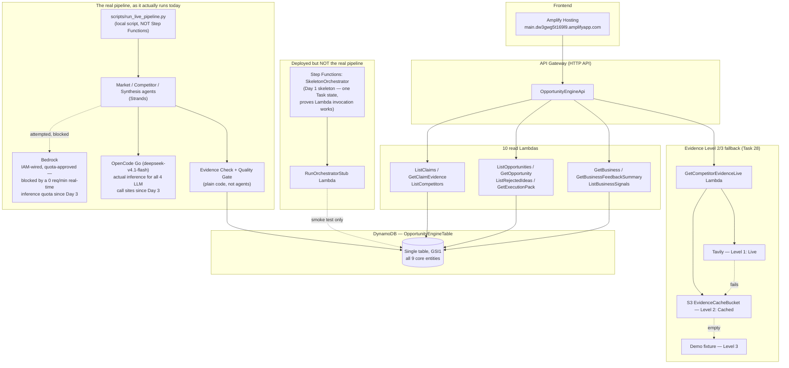

# Architecture diagram (for §21, 2:40–2:50)

What's actually deployed and actually running, as of 2026-09-20 — not the original plan.
Two things drifted from `tasks/plan.md`'s Day 1 architecture line during Day 3 (see
`LEARNING.md`, Day 3/4), and this diagram shows the drift instead of hiding it: that's
consistent with the project's own rule that a substitution is always labelled, never silent.

## The two honesty notes, spoken plainly for narration

1. **Bedrock vs. OpenCode Go.** Bedrock access was confirmed and IAM-wired on Day 1. Day 3
   root-caused why every agent call was silently timing out: the account's real-time inference
   quota is 0 req/min for every Bedrock model, with no ETA on an increase. Rather than block on
   an AWS support ticket, all four LLM call sites (Market Agent, Competitor Agent, Synthesis
   Agent, Evidence Check's semantic-support check) were switched same-day to OpenCode Go
   (deepseek-v4.1-flash), an already-paid-for subscription. That's what's actually generating
   every real signal, claim, and evidence verdict in the live demo.
2. **Step Functions vs. the real pipeline.** The deployed state machine is still Day 1's
   skeleton — one Task state invoking one stub Lambda, proving Step Functions → Lambda deploys
   and runs. The real five-stage graph (parallel research → Synthesis → Evidence Check → Quality
   Gate → DynamoDB) that produced `opp_run_7f023794a99d_0` ran via
   `scripts/run_live_pipeline.py`, a local script writing to the same live DynamoDB table —
   not through the deployed state machine.

Both are framed as "what we found and adapted to," not hidden — the Learning criterion rewards
exactly this, and it pre-empts a judge finding either gap by reading the code instead of hearing
it from us first.

## What to actually show on screen

Not a screen recording — this file, opened in a Markdown/Mermaid preview (GitHub renders it
natively), or exported to an image if the mermaid render looks better full-screen. Pair with the
Run details line: pull real timings/tokens/cost for `opp_run_7f023794a99d_0` from
`scripts/run_live_pipeline.py`'s own run log before recording — no dedicated cost-panel screen
exists in the UI, and §19.1 already treats that as fine for a video-only overlay.
