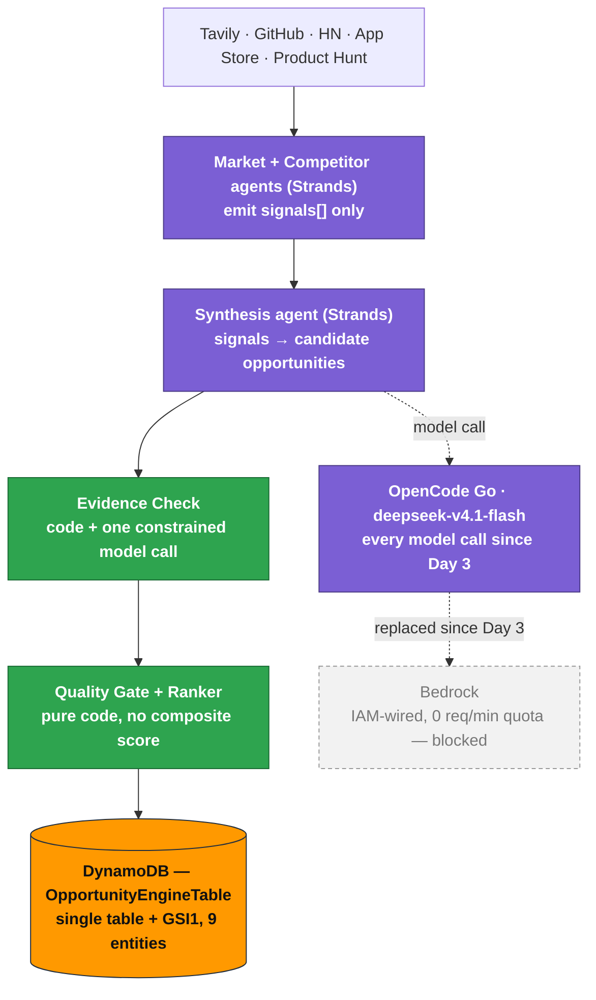
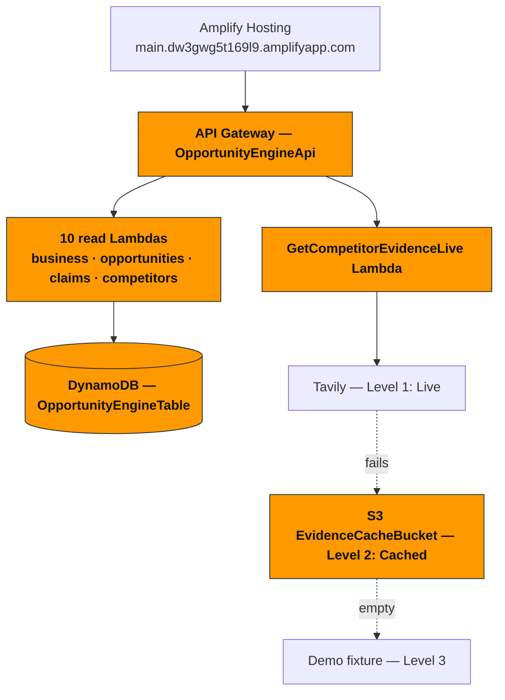

# Architecture — what's actually deployed

As of 2026-09-20, not the original plan. Two things drifted from `tasks/plan.md`'s Day 1
architecture line during Day 3 (see `LEARNING.md`, Day 3/4); both are labelled below rather than
hidden, consistent with the project's own rule that a substitution is never silent.

Two diagrams, because there are two separate paths: one that **produces** opportunities, one
that **serves** them. They meet at DynamoDB and nowhere else.

## 1. Producing — `scripts/run_live_pipeline.py`

A local script, **not** the deployed state machine. It produced `opp_run_7f023794a99d_0` and
wrote it to the same live DynamoDB table the API reads from.

Purple = a model decides; green = code decides. The dashed edge into OpenCode Go stands for
every model call in the pipeline, not just Synthesis's — drawing one edge per call site is what
made the earlier version of this diagram unreadable.

The Action agent (execution packs) runs separately, per-opportunity, via
`scripts/run_action_agent_live.py`.

## 2. Serving — API Gateway → Lambda → UI

11 read Lambdas in total. The 12th deployed function, `RunOrchestratorStub`, is invoked only by
the Day 1 Step Functions skeleton (`SkeletonOrchestrator`, one Task state) — a wiring smoke test,
not on any user-facing path, which is why it isn't drawn above.

## The two honesty notes, spoken plainly for narration

1. **Bedrock vs. OpenCode Go.** Bedrock access was confirmed and IAM-wired on Day 1. Day 3
   root-caused why every agent call was silently timing out: the account's real-time inference
   quota is 0 req/min for every Bedrock model, with no ETA on an increase. Rather than block on
   an AWS support ticket, every LLM call site — Market, Competitor, Synthesis and Action agents,
   Evidence Check's semantic-support check, and the feedback labeller — was switched same-day to
   OpenCode Go (`deepseek-v4.1-flash`), an already-paid-for subscription. That's what's actually
   generating every real signal, claim, and evidence verdict in the live demo. Only the model
   behind each call changed; the surrounding agent architecture didn't.
2. **Step Functions vs. the real pipeline.** The deployed state machine is still Day 1's
   skeleton — one Task state invoking one stub Lambda, proving Step Functions → Lambda deploys
   and runs. The real five-stage graph (parallel research → Synthesis → Evidence Check → Quality
   Gate → DynamoDB) ran via the local script in diagram 1.

Both are framed as "what we found and adapted to," not hidden — the Learning criterion rewards
exactly this, and it pre-empts a judge finding either gap by reading the code instead of hearing
it from us first.

## What to actually show on screen (§21, 2:40–2:50)

Not a screen recording — this file, opened in a Markdown/Mermaid preview (GitHub renders it
natively), or exported to an image if the mermaid render looks better full-screen. Pair with the
Run details line: pull real timings/tokens/cost for `opp_run_7f023794a99d_0` from
`scripts/run_live_pipeline.py`'s own run log before recording — no dedicated cost-panel screen
exists in the UI, and §19.1 already treats that as fine for a video-only overlay.
