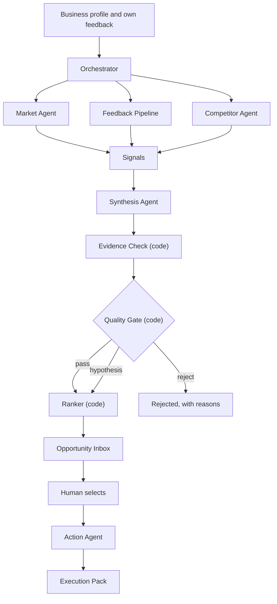
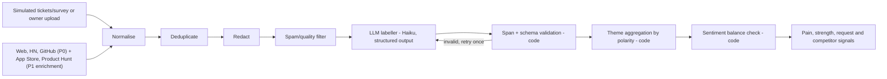

# Opportunity Engine — PRD v8

### Turn market signals and customer feedback into evidence-backed growth opportunities.

**Event:** WeMakeDevs × AWS First Commit — Thu 17 to Sun 20 Sept 2026
**Team:** 2 people · 4 days (rules allow up to 4; we're staying at 2 by choice)
**Prizes targeted:** Ship It (₹2,00,000 + $3,000, requires a live AWS deployment + URL) and Best UI (₹1,00,000 + $1,000), from one submission — and per the confirmed track mechanic (§0.1), the same submission is automatically considered for Build It (₹1,50,000 + $2,000) too, so nothing here is designed to work against that track
**Name:** "Opportunity Engine" is a placeholder. Rename freely; the data model prefixes (`opp_`, `OPP#`) stay valid either way.

> **⚠️ Eligibility gate, confirmed 17 Sept 2026, present in no prior version of this PRD:** entry requires every team member to be a **university student in India, 18 or older**, with **verified student status on their AWS Builder Center profile**, in addition to a WeMakeDevs account. This is stated directly on the rules page. Neither v5, v6, nor the external review that prompted this revision checked it — all three treated "register on WeMakeDevs + AWS Builder Center" as a formality rather than a gate that can end participation before the product matters at all. **Confirm every team member clears this before anything else.** See §0.1.

---

## 0. What changed — v8 hardens data acquisition and the data model, and removes the composite score

v6 fixed the reasoning-chain gap (pain + strength → a stated, gate-checked mechanism) and corrected several hackathon-rule assumptions inherited from v5. v7 re-checked the rules a second time (catching the eligibility gate every prior version missed) and closed two architecture-naming gaps. **v8 is a data-and-architecture hardening pass, triggered by a third external review, focused on the two places a technical judge is most likely to probe: where the evidence-to-opportunity chain could quietly break, and whether the numbers on screen actually add up.** It bounds agent autonomy with an explicit runtime contract (§10.1a), rebuilds the data model around nine entities anchored by a first-class Claim so "where did this come from" always has a click-through answer (§14), promotes data acquisition — specifically the Tavily/web-extraction dependency — to the PRD's top named risk with a formal three-level fallback (§7.2), and removes the composite opportunity score entirely rather than patch the arithmetic bug that prompted the question (§13.1). **The product concept still does not change.** This is a harder verification pass, not a pivot, and — as with v7 — every remaining hour still goes into the golden path once this pass is done.

### 0.1 Terms verified against the official rules (checked 17 Sept 2026)

v5 stated several hackathon rules as assumptions. They've now been checked against `wemakedevs.org/aws/first-commit`, `/rules`, and `/schedule`. Results:

| PRD v5 claim | Verified status | What the source actually says |
|---|---|---|
| Event is Thu 17–Sun 20 Sept 2026 | ✅ Confirmed | Online track runs all 4 days; optional in-person day is Sat 19, 8am–8pm, Bangalore |
| "Work starts when the clock starts" | ✅ Confirmed, and stricter than stated | "Old projects do not count. Build something new once the clock starts." Prior *learning* is fine; prior *code* is not. |
| "Repo history must match the window" | ⚠️ Upgraded — this is a disqualification rule, not a best practice | *"Copying someone else's work, passing an old project off as new, or a repository whose history does not match the event dates disqualifies the whole team."* This is the single highest-severity rule in the PRD. See §2 and §22. |
| "No live demo; only the submission is judged" | ✅ Confirmed, submission is 3 parts, not 2 | *"A submission is three things: a public repository, a demo video of up to three minutes, and a short writeup."* v5 only mentioned repo + video — the **writeup** (problem, build, AWS integration) is a required third artifact. "Judges score what you submit and nothing else." |
| "Reused code must be credited and licence-compatible" | ✅ Confirmed | *"The work has to be yours. Anything you did not write needs a credit and a licence."* Open-source libraries/frameworks/templates are explicitly permitted. |
| "AI coding tools must be named" | ✅ Confirmed, and the location is specified | *"You can use AI coding tools. List the ones you used in your writeup."* — this belongs in the required writeup, not just a README section (keep both; writeup is the one judges are told to expect). |
| "Learning is scored" | ✅ Confirmed | "Learning" is one of the named judging criteria alongside Idea & Impact, Built on AWS, and Execution, plus demo video quality. No published weighting. |
| "Late submissions aren't scored" | ⚠️ Corrected — stricter | *"Deadlines are strict... Once the deadline passes you cannot submit."* Not "scored zero" — submission is impossible. **The exact deadline hour is not yet published** ("the hours are being finalised... they land on this page first" — as of today, Day 1). Do not plan around "mid-afternoon Day 4" as a hard assumption; re-check the schedule page and build in same-day slack (target being submission-ready by Saturday night). |
| Prizes: "Ship It and Best UI, from one submission" | ✅ Confirmed, and the mechanic is better than assumed | *"Nothing to pick when you enter. Ship It, Build It and Best UI are decided by what your project turns out to be, and one submission is considered for all three."* You don't select a track. Ship It (1st, requires a live AWS deployment + URL) and Best UI (3rd, UI-quality axis) are not mutually exclusive — the plan to target both from one deployed submission is exactly how the mechanic works. |
| Team size | ⚠️ Clarified | Rules allow **1–4**; "2 people" is our choice, not a constraint. |
| — (not in v5) | 🆕 New constraint found | Every member registers individually with a WeMakeDevs account **and a verified AWS Builder Center profile**. Do this on Day 1, hour 1 — an unverified profile is a submission blocker that has nothing to do with the product. |
| — (not in v5) | 🆕 New constraint found | "One submission per team. One team per person per hackathon." Not a design constraint, but confirms there's no benefit to hedging with a second idea. |
| **Eligibility** — not in v5 or v6, missed until this pass | 🆕 **Critical gap, checked live a second time on 17 Sept 2026** | *"You can enter if you are a university student in India and you are 18 or older."* The event runs fully online, so anywhere in India qualifies; staff of WeMakeDevs, AWS or the judging panel may compete but cannot win prizes. This is a hard entry gate that has nothing to do with the product and was never checked before this revision — confirm it for every team member before planning goes any further. |
| AWS Builder Center profile, sharpened | ⚠️ The earlier row above undersold this | The requirement isn't just "an account" — it must carry **verified student status**. Budget time for the verification step itself on Day 1, since account creation and verification can be two separate delays. |
| Build It stack (2nd prize, ₹1,50,000 + $2,000) — not previously listed in this PRD | 🆕 New, relevant even though we are not building for this track | *Strands Agents SDK, PartyRock, Cedar, SAM CLI + LocalStack, OpenSearch, Firecracker, Corretto* — described as "open-source tools on local machine," a different posture from Ship It's live-cloud stack. Because **one submission is automatically considered for all three tracks** (row above), using the **Strands Agents SDK** for the agent layer — already the plan (§10.1) — is legitimate overlap at no extra cost. Nothing else on this list is worth adding artificially; see §0.4 for why we're not chasing Build It's other tools (OpenSearch, Cedar, PartyRock) just because they're named. |
| Ship It stack, re-confirmed and one gap found | ✅ Re-confirmed, with a fix | Lambda, API Gateway, DynamoDB, S3, Amazon Bedrock, **Amplify Hosting**, App Runner, Cognito, EventBridge, Step Functions. v6's §17 never named a frontend hosting service, even though Amplify Hosting is one of the nine services the event explicitly lists. Fixed in §17.1–17.2. |
| "AWS use must be visible in the video, not just named" | ✅ Confirmed | The rules page states the demo video specifically has to show AWS integration — naming AWS only in the writeup doesn't satisfy this. Already reflected as a load-bearing beat, not optional padding, in §21 (2:40–2:50) and §2. |

Sources: [First Commit](https://www.wemakedevs.org/aws/first-commit) · [Rules](https://www.wemakedevs.org/aws/first-commit/rules) · [Schedule](https://www.wemakedevs.org/aws/first-commit/schedule) — re-fetched live a second time on 17 Sept 2026 for this revision, specifically to check eligibility and the Build It stack, neither of which any prior pass had verified.

### 0.2 Keep, reduce, strengthen (carried from v5, extended)

| | |
|---|---|
| **Keep unchanged** | Opportunity Inbox (not a dashboard); competitor-pain + own-strength reasoning; positive **and** negative feedback as first-class; Evidence Check as a deterministic gate; planted truths/red herrings for measurable evaluation; simulated business + real market/competitors; human-controlled execution; vertical playbooks; AWS architecture; cost visibility; five P0 screens; the "any business" wording from §0.2 of v5 (already correctly scoped — no further change needed) |
| **Reduce** | Nothing new cut in v6 — v5 already reduced scope correctly. Resist the urge to cut further; the risk now is under-building, not over-building. |
| **Strengthen** | An explicit **opportunity mechanism** field bridging evidence to commercial rationale (§9.5, §14.8); **claim-evidence semantic support**, not just quote existence, in the Evidence Check (§12); "evidence diversity" replacing the overclaiming word "triangulation" (§11, §12); a mandatory-fields gate so no opportunity reaches the inbox with a missing Target/Pain/Advantage/Mechanism/Timing/Action/Economics/Evidence (§11); the quality gate reorganised into four legible groups (§11); an explicit outreach-privacy policy so drafts use insight without exposing surveillance (§18); cached-evidence fallback promoted from "storage rule" to an explicit demo-resilience behaviour (§12.2); the hackathon rules table corrected against source (§0.1, §2); **v7 additions:** the agent framework and frontend host named as explicit decisions rather than implied (§10.1, §17); one label system — **Observed / Inferred / Assumed** — generalised from the Target/Account model to every claim on the opportunity card (§13.3); the web-search provider resolved to one choice instead of left open (§7); **v8 additions:** every research agent bound by an explicit, enforced runtime contract (§10.1a); the flat "inherits v3's shape" data model replaced by nine explicit entities anchored by a first-class Claim, with a full SourceDocument → Evidence → Claim → Opportunity provenance chain (§14); the Evidence entity expanded with `quote_hash`, structured `claim_support` and `freshness` (§12); evidence diversity turned into a measured object rather than a pass/fail heuristic (§11.2); the composite opportunity score removed in favour of separately-shown Evidence confidence, Potential value and a rule-based Priority (§13.1); the value model's worked example corrected and `estimated_qualified_accounts` distinguished from the observed `signal_count` (§13.2); data acquisition risk (Tavily/web extraction) elevated to an explicit three-level resilience ladder (§7.2) |

### 0.3 What was considered and rejected for v6

An external review of v5 raised 30 points before this revision. Most of its good ideas are folded in above. Three are explicitly **not** adopted, and it's worth saying why so the team doesn't relitigate them:

- **Renaming the core loop** to "Signal → Connect → Prove → Prioritize → Act." Cute, but the existing loop name (`Discover → Investigate → Synthesise → Verify → Prioritise → Act → Track`) is threaded through the mermaid diagram, agent names, and every section reference. Renaming it now costs a rewrite for a marketing nicety. If a punchier phrase is wanted for the demo narration only, use it as spoken narration in §21, not as a schema/diagram change.
- **Building the full Target Accounts feature.** v5 already demoted this to a P1 overlay showing 1–2 accounts inline (§16.2) — the review's own concern was already addressed before it was raised. No further scoping-down needed; just don't let it creep back up.
- **Solving evidence independence rigorously** (e.g., proving two sources aren't the same underlying event). Correct concern, wrong fix for 4 days. §11/§12 adopt a cheap heuristic (different author/handle + different URL/domain) and rename the concept honestly ("evidence diversity," not "triangulation") rather than building real independence detection.

### 0.4 Triage of the external v6 review (accepted, already covered, or rejected — checked, not assumed)

A second external review — this time of v6 — raised roughly 30 more points, several genuinely sharp. Checked against the live event page and against what v6's own text already does, they split three ways.

**Accepted and changed in v7:**

- The rules table (§2) had one wording bug worth fixing: a row said "judges score exactly three things: a public repo, a demo video, and a short writeup," which conflates the **three submission artifacts** with the **five judging criteria** (Idea & Impact, Built on AWS, Learning, Execution, Demo Video) applied to them. Fixed.
- No named frontend hosting service — a real gap, since Amplify Hosting is one of the nine services the Ship It stack explicitly lists and v6 never placed the React app anywhere. Fixed in §17.1–17.2.
- The agent framework (Bedrock via the **Strands Agents SDK**) was implied per-component in the architecture table but never stated once as a named decision — worth stating explicitly, partly because Strands is also specifically named in the Build It stack (§0.1). Fixed in §10.1.
- "Pick one web search provider, not 'Tavily or Exa'" — fair; a hackathon PRD shouldn't carry an unresolved binary into build days. Resolved to Tavily with a stated reason and a one-line fallback path in §7.
- Formalising **Observed / Inferred / Assumed** as a labelling pattern used everywhere a claim reaches the UI, not only in the Target/Account model where v6 already had it. Genuinely good generalisation of something v6 was already doing in one place. Added as §13.3.
- The "why serverless" cost-narrative line for judges — a good piece of spoken framing that wasn't previously written down anywhere. Added to §17.1.

**Already done in v6 — reviewed, not changed:**

- "Soften the 'works for any business' claim." v6 §3.1 already states almost verbatim the fix proposed — "the reasoning engine is vertical-agnostic; playbooks adapt the evidence sources, opportunity types, and economics to each business" — and v6's own §0.2 flagged this as already handled going into v6. The review appears to have been checking against an earlier draft of the reasoning, not v6's actual §3.1 text.
- "Be more honest that the Evidence Check isn't pure code." v6 §10.1 and §10.2 already describe it as "code (+ one lightweight model call for semantic support)," not as pure deterministic verification. Tightened one sentence in §1.2 for extra clarity; not restructured.
- "Make rejected opportunities prominent." First-class UI element since v5 (§1.3, §11, §16.1) — not new.
- "Don't rename the core loop." v6 §0.3 already considered and rejected this, for the same reason this review would likely accept if it had read that section.
- "State why pain + strength alone isn't an opportunity." This is v6's own headline addition, the opportunity mechanism (§9.5) — not a gap the review found, though it's right to flag mechanism-writing as the hardest and highest-value part of the build.

**Considered and rejected:**

- **Cutting P0 scope by roughly 25–35% at the prose level.** The instinct — four days doesn't support everything listed — is correct and is already the entire discipline behind §16.1, §20, and the Day-3 feature freeze (§22). But the review's specific proposed cuts would remove things v6 already scoped down on purpose: the Execution Pack is already offer + proposal + outreach with no CRM and no target-account database (§0.3, §16.2); Anveshan Precision's screen time is already a 10–20 second clip, not a second demo (§3.2, §21). There isn't more fat here without cutting into the golden path itself.
- **Splitting this PRD into `PRD.md` / `HACKATHON.md` / `BUILD_PLAN.md` / `LEARNING.md`.** Reasonable instinct for a longer-lived document; for a 4-day build where this PRD's whole job is to be the one place the team checks during integration, splitting it trades a shorter read for a four-way sync problem. `LEARNING.md` already exists separately by design (§2, §22) because it's a genuinely different kind of document — a daily journal, not a spec. The rest stays together.
- **Reducing five P0 screens to four**, folding the Execution Pack into the Opportunity Detail screen. Screen 5 is the "Humans decide" half of the product's own tagline (§1.1) and the only place `outreach_policy` (§18.1) and the account-evidence-integrity gate check (§11.4, check 14) are shown end-to-end — collapsing it into Detail buries the moment the product's ethics work is meant to be visible. Stays separate.

### 0.5 Triage of an external review of v7 (accepted, already covered, or rejected)

A third external review raised roughly 20 more points — this time mostly about architecture boundaries, data acquisition risk, the data model, and the scoring math. Checked point by point:

**Accepted and changed in v8:**

- Agent runtime contracts made explicit and enforced (§10.1a) — every agent gets `max_iterations` / `max_tool_calls` / `max_runtime_seconds` / `max_results` / `max_tokens`, and "signals[] not opportunities[]" becomes a schema constraint the agent literally cannot violate, not just a design intention. This is purely additive to the existing orchestration (§4, §10) — Step Functions still orchestrates Lambda, Strands still runs inside each Lambda; nothing about that shape changes.
- Data acquisition promoted to the PRD's top-named risk category, with Tavily/web extraction called out explicitly as the single most fragile dependency, and the cached/live fallback formalised into three explicitly labelled levels (§7.2, §12.2).
- Data model rebuilt around nine core entities, with a first-class Claim entity separating "why_this / why_you / why_now" from prose strings into evidenced, independently-checkable units, and an explicit provenance chain from SourceDocument through to Opportunity (§14).
- Evidence entity expanded with `quote_hash`, `claim_support` and `freshness` as structured fields, not just a "quote found" boolean (§12, §14.5).
- Evidence diversity (§11.2, check 6) expanded from a yes/no heuristic into a diversity object (`source_kind_count`, `domain_count`, `author_count`, `underlying_event_risk`) that's honest about what it isn't proving.
- Composite `opportunity_score` removed entirely (§13). The arithmetic bug the review caught (`0.30·0.91 + 0.25·0.88 + 0.20·0.76 + 0.15·0.82 + 0.10·0.65 = 83.3`, not 84) is moot because there is no longer a single formula to get wrong — Evidence confidence, Potential value, and a rule-based Priority tier are shown as three distinct, individually-defensible things instead.
- Value model math fixed and `qualified_accounts` reframed: the previous example (20–60 accounts × 5% × $99 = $99–$297 MRR) never matched the UI's stated $6k–$18k MRR. Corrected to `estimated_qualified_accounts` (1,200–3,600), explicitly marked ASSUMED and distinguished from the observed `signal_count` that seeds the estimate (§13.2).
- Target/Account model's `derived_signals` now each carry `confidence`, `last_verified_at` and `evidence_ids`; `role_reason` becomes a structured `{role, reason, basis}` object, consistent with the Observed/Inferred/Assumed discipline already applied elsewhere (§14.9).

**Already true in v7 — reviewed, not changed:**

- AWS service selection. The review's recommended architecture (Amplify → API Gateway → Step Functions → parallel Lambdas → S3 → Synthesis → Evidence → Quality/Risk → DynamoDB/S3 → API Gateway → Amplify) is, service-for-service, the stack v7 §17 already specifies. Nothing added, nothing removed.
- "Independent sources" was already renamed to "evidence diversity" back in v6/v7 (§0.3, §11.2) rather than claiming independence — the review's proposed fix is v8's `evidence_diversity` object formalising a heuristic that was already honestly named, not a new correction to a false claim.
- Building the full evidence graph UI early. §16.2 already scopes it as stretch, build-only-if-screens-1–5-are-frozen. v8 adds one sentence noting the new Claim → Evidence → Source structure (§14) already gives the evidence drawer the linear version of that graph for free — exactly the review's own argument for deprioritising the clickable graph further.
- Orchestration shape (Step Functions over Strands agents in Lambda). The review calls this "conceptually good" and its actual ask — bound agent autonomy — is what §10.1a adds; the orchestration diagram in §4 does not change.

**Not adopted:**

- Nothing in this pass is rejected outright; every substantive point either matches what v7 already did or is adopted above. The one thing intentionally left alone is real evidence-independence detection (whether three sources trace to the same underlying event) — the review itself only asks for honester labelling here (done, `evidence_diversity`), not for building real independence detection, which stays out of scope for the same four-day reasons as §0.3.

---

## 1. Product summary

**Opportunity Engine finds where a competitor's customers are unhappy about something the business is already good at, backs that claim with evidence code can verify, estimates what it's worth against the owner's goal, and hands the owner an execution pack they control.**

The reasoning move at the center of the product:

```
Competitor's customers complain about X
              +
Your customers say you're strong at X
              +
A stated reason the combination is commercially actionable (the "mechanism")
              =
An underserved segment, with evidence on both sides and a reason it isn't a coincidence
```

The third term is new in v6 (§0.1 self-critique, §9.5): pain + strength alone can correlate without being an opportunity (a competitor's users complaining about price and your users liking your onboarding don't automatically combine into anything). The engine now has to state *why* the combination is actionable, not just that both halves exist.

For PulseStack: Sentry customers complain about alert fatigue → PulseStack customers praise low false-positive alerts → **mechanism:** PulseStack already serves teams the size that generates this complaint, so the fit isn't hypothetical → opportunity: target teams migrating away from heavier monitoring tools.

The product is an **Opportunity Inbox**, not a dashboard. Every card answers:

> **What opportunity exists → Why it exists → The evidence → Why it fits this business → Why the combination is actionable, not a coincidence → What to do next.**

### 1.1 The product principle

> **Agents discover. Code verifies. Humans decide.**

Everything else in this document is that sentence, expanded. Research agents propose signals — never opportunities (§10). A deterministic Evidence Check and Quality Gate decide what's allowed into the inbox (§11–§12). A human decides what to send (§16, screen 5).

A second, equally important framing, carried forward from v5 because it's one of the strongest differentiators and deserves to be said out loud to judges, not just implemented:

> **Opportunity isn't just about finding demand. It's about knowing whether you're ready to capture it.** (§9.3 fix-first rule)

### 1.2 Why not ask a chatbot or deep-research agent?

A general AI can research a market. The sharper answer:

> "A general AI can research your market. Opportunity Engine creates a closed evidence loop between market demand, competitor pain, your own customer feedback, and your actual capabilities — then programmatically verifies every claim before it's allowed into the opportunity inbox. Watch: here's a claim it rejected, and why."

Then it's demonstrated, not asserted (§16 signature moment for the Opportunity Detail screen; §21 demo beat). Rather than spending demo time contrasting against a generic chatbot's output in the abstract, show the two outputs side by side and let the gap speak (§21) — asserting "we're better than ChatGPT" invites the judge to think "I could just prompt it differently"; showing a verified, sourced card next to three bland bullet points doesn't invite that objection.

The supporting reasons:

1. **It reads the business's own feedback** — support tickets, reviews, churn notes — not just the public web.
2. **It checks competitors' real reviews**, both what their customers love and what they complain about, and pairs that against the business's own strengths and gaps.
3. **Deterministic code verifies quote existence, source, date and attribution — and a separate, constrained model call checks that the quote actually supports the claim**, not merely that the quoted words exist somewhere in a stored source (§12). Said this precisely on purpose: calling the whole check "code verification" overclaims when one step is still a model judgment, and a sharp judge will ask exactly that question.
4. **It fits the business.** Opportunities are matched to confirmed capabilities, with value estimated from the business's own numbers.
5. **It ends in action** — a target list, an offer, outreach drafts — with the human sending, and without exposing how the system found what it found (§18).

### 1.3 What the inbox home screen looks like

```
Your goal
$15k additional MRR · 90 days

━━━━━━━━━━━━━━━━━━━━━━━━━━━━━━━━━
Potential identified: $12k–$21k MRR
━━━━━━━━━━━━━━━━━━━━━━━━━━━━━━━━━

🔥 High-confidence opportunities
  1. Capture monitoring migrations         $6.5k–$9.2k
  2. Target seed-stage startups            $4.1k–$5.7k

⚠ Blocked by a product issue first
  3. Multi-service onboarding fix-first     —

💡 Additional hypotheses (lower confidence)
  4 more

Ideas we rejected (2) →
```

This is the money screen (§16). Not "here is everything our AI knows about your business" — "here are the things you could do to hit your goal, ranked, with what's blocking the rest."

### 1.4 Example opportunity card (the "aha" moment)

```
🔥 Opportunity #07
Capture teams migrating away from heavyweight monitoring platforms

Priority: HIGH                    Evidence confidence: HIGH
Potential: $9.2k–$18.4k MRR [ASSUMED]
(priority = where this ranks in your inbox, from evidence confidence and
 the fix-first check, §13.1; potential value is a separate, editable
 estimate, §13.2 — these are different numbers, shown separately on purpose)

WHY THIS  [OBSERVED]  Public discussions show teams evaluating alternatives
                      following pricing/complexity concerns.
WHY YOU   [OBSERVED]  PulseStack customers repeatedly praise low false-positive
                      alerts — the thing those same threads complain about.
WHY NOW   [OBSERVED]  A named competitor's recent pricing change is visible in
                      8 public discussions in the last 45 days.
MECHANISM [INFERRED]  PulseStack already serves teams in the 3–15 engineer range
                      that generate this exact complaint pattern — this isn't a
                      hypothetical fit, it's the segment already being served.

Your fit
  ✓ Slack integration        ✓ On-call paging
  ✓ $29 starter plan         ✓ 3–15 engineer ICP

What to do
  Target engineering teams publicly evaluating alternatives.

Evidence
  8 verified signals · source diversity: 3 kinds, 4 domains, 6 authors
  (underlying-event risk not assessed — §11.2) · no unresolved contradiction

[ Why this priority? ] [ Ideas we rejected ] [ Evidence chain: Claim → Evidence → Source ] [ Edit assumptions ]
```

The `MECHANISM` line was added in v6; the `[OBSERVED]` / `[INFERRED]` / `[ASSUMED]` tags were added in v7 (§13.3). v8 removes the composite score and its bar-chart breakdown (§13.1) and replaces the old evidence-count line with the source-diversity readout from the new `evidence_diversity` object (§11.2) — everything else in this PRD is infrastructure supporting this card.

---

## 2. Hackathon rules we design around (verified 17 Sept 2026 — see §0.1 for sourcing)

| Rule | How we comply |
|---|---|
| **Eligibility: university student in India, 18+, verified on both WeMakeDevs and AWS Builder Center** (§0.1 — checked for the first time in this revision) | Every team member confirms eligibility and completes both verified registrations in the first hour of Day 1, before any code. This is a hard entry gate, not paperwork to defer. |
| Work starts when the clock starts; old projects don't count | No code, datasets or corpus before Thu 17 Sept. Any pre-event work is confined to `LEARNING.md`-style notes about approach, never committed code or generated data. |
| **A repository whose commit history doesn't match the event dates disqualifies the whole team** | Public repo created Day 1, first commit literally on Day 1; frequent, dated commits; generated data committed with its generator and seed so the timeline is self-evidently real. Treat this as the single highest-severity compliance item — see §22. |
| Submission is exactly three artifacts — a public repo, a demo video ≤ 3:00, and a short writeup — and judges score only what's in them, against five named criteria (Idea & Impact, Built on AWS, Learning, Execution, Demo Video), not a track we pick | The video shows every feature that matters, including one short live run; the writeup covers problem, build, and AWS integration and is treated as a first-class deliverable, not an afterthought; nothing is held back for a live Q&A that doesn't happen |
| **AWS use has to be visible in the demo video itself, not just named in the writeup** | The architecture beat (§21, 2:40–2:50) is treated as load-bearing, not optional padding — Bedrock, Step Functions, Lambda, S3, DynamoDB and Amplify Hosting are all shown on screen, not only listed in text |
| Reused code must be credited and licence-compatible | `CREDITS.md` |
| AI coding tools must be named in the writeup | Listed in the writeup itself (not only buried in a README section) and mirrored in `README.md` "Tools we used" |
| Learning is scored (one of the named judging criteria) | `LEARNING.md` from Day 1 |
| Deadline is hard — submission is impossible after it passes, exact hour TBD as of Day 1 | Target being submission-ready by Saturday night; re-check the schedule page daily for the published hour; placeholder submission Day 1, final polish pass Day 4 morning |
| Ship It, Build It and Best UI are auto-assigned from what's submitted — no track to pick, one submission can win more than one | Build for a live AWS deployment (Ship It) with deliberate UI polish (Best UI); the Strands Agents SDK choice (§10.1) also happens to line up with Build It's named stack; no submission-form decision needed |

---

## 3. Users, scope and the sample-business policy

### 3.1 Vision

Any business — local or not, product or service, B2C or B2B — that wants growth but lacks the time to research its market, watch its competitors, and act on its own customer feedback systematically. The architecture is vertical-agnostic; what we *demo and claim* stays opinionated about the verticals where public review/forum signal is actually dense enough to work: **"The reasoning engine is vertical-agnostic; playbooks adapt the evidence sources, opportunity types, and economics to each business."** That sentence is the one to say to a judge — it's defensible in a way "works for any business" is not.

### 3.2 Hackathon scope

Four days is enough for one fully working vertical plus playbooks that prove the engine generalises.

| Priority | Business | Vertical playbook | Goal | Role |
|---|---|---|---|---|
| **P0 — flagship** | **PulseStack** — a small B2B SaaS company selling lightweight error and uptime monitoring for engineering teams (an alternative to heavier tools) | `b2b_saas_it` | $15k new MRR / 25 new paying teams in 90 days | Full golden path, live in the video |
| P1 | **Anveshan Precision** — a mechanical/electronics parts job-shop manufacturer supplying automotive and appliance OEMs | `b2b_parts_manufacturer` | ₹40L new order value this quarter | 20-second "same engine, different business" moment |
| P2 | **Koa Studio** — a solo fashion designer selling made-to-order clothing direct to consumer | `d2c_consumer` | 2x monthly orders in 90 days | Evaluation set only, shown only if time remains |

### 3.3 The sample-business policy (unchanged principle, generalised)

Four days rules out recruiting real business owners, so:

- **PulseStack is simulated.** Its own product feedback (support tickets, in-app survey responses, churn notes, feature requests) is generated by our simulator from a documented scenario, with a fixed seed.
- **Its competitors are real.** PulseStack competes against named, real monitoring/observability products. Their public reviews, forum discussions and public complaints are real, retrieved live or collected by our own pipeline during the event, and shown with proper attribution.
- **Every item is labelled by origin** (`simulated`, `owner_upload`, `web_public`, `app_store`, `product_hunt`, `github`, `hn`, `model_inference`), and the UI carries a **"Simulated company · real competitors and market"** badge.
- **No simulated claim is ever attributed to a real company.** A real competitor can only be referenced with reasons based on its own public reviews, listings, or public activity — never a claim invented for PulseStack.
- **Planted truths and red herrings** are hidden in PulseStack's scenario so the engine's output can be measured, not just admired (§19). This measurability *is* part of the pitch — see §21. When a judge asks "isn't the AI just finding the answers you planted?", the answer is: *"The simulator creates realistic business-side feedback and hidden evaluation labels. The external competitor and market evidence is independently retrieved from the live web, not authored by us. The engine's IAM role cannot read the truth manifest — it never sees the answer key."*

---

## 4. Core loop

**Discover → Investigate → Synthesise → Verify → Prioritise → Act → Track**

The simplified P0 architecture (Pipeline/CRM loop-back is a P1 overlay, not load-bearing for the demo):



Note the two places code sits, not agents: Evidence Check and Quality Gate + Ranker. And note the Action Agent only ever receives what came out the far side of the gate — never raw research signals (§10.3). New in v8: every agent invocation shown in this diagram is bound by the runtime contract in §10.1a, and the Ranker step now applies the priority rule table in §13.1 rather than a computed score.

**Guiding dimensions, not a literal formula:** every opportunity is assessed along four axes — **Demand** (is there a real problem?), **Fit** (can this business solve it?), **Timing** (why act now?), **Evidence** (how strong is the proof?). v8 deliberately doesn't collapse these into one computed score (§13.1) — Evidence confidence, Potential value and a rule-based Priority tier are shown separately instead; this paragraph is the mental model behind all three, not a formula behind one number.

Separately, and not to be confused with the axes above, is the **value model** — what an opportunity is worth in dollars (§13.2). Demand/Fit/Timing/Evidence decide *whether and how confidently* to surface an opportunity; the value model decides *how big* it is. A third, also-separate number is **evidence confidence** (§12) — how sure we are the underlying evidence is true, as opposed to how attractive the opportunity is. §13.1 keeps all three distinct on screen, not just in the schema.

---

## 5. Opportunity taxonomy (vertical-agnostic)

v5 listed six items as one flat list, mixing genuinely different kinds of things — "competitive gap" is an opportunity, "retention risk" is a problem, "channel" is a distribution mechanism, "timing" is a condition, "partnership" is a strategy. v6 splits **what kind of opportunity it is** from **what's modifying its priority**, which also makes the data model and UI cleaner.

### 5.1 Opportunity type (mutually exclusive — pick one per opportunity)

| Type | Question | PulseStack example |
|---|---|---|
| **Acquire a segment** | Which ICP segment is underserved right now? | Seed-stage teams priced out of heavier tools, visible in public pricing complaints |
| **Exploit competitive gap** | What do competitors' customers complain about that PulseStack is already strong at? | Competitor reviews complain about alert noise; PulseStack's own reviews praise low false-positive rate |
| **Expand channel** | Where does the ICP already gather that isn't being used yet? | HN threads, a relevant subreddit, a Product Hunt launch cohort |
| **Create partnership** | Who could distribute or bundle this? | A CI/CD tool or PaaS whose users publicly ask for lighter-weight monitoring |
| **Increase retention** | What in PulseStack's own feedback threatens growth if ignored? | Support tickets show onboarding confusion for multi-service setups |

### 5.2 Opportunity modifiers (apply to any type above, non-exclusive)

- **Why now** — a time-bound signal creating urgency (e.g. a competitor's price increase)
- **Evidence strength** — see §12 confidence derivation
- **Competitive pressure** — how many named competitors show the same pattern
- **Customer pain severity** — how acute the underlying complaint is
- **Business fit** — confirmed-capability match ratio (§13.1)

Rejected and flagged ideas are always shown, because they prove the quality gate is real.

---

## 6. Business-model playbooks

The engine stays generic. A small config per vertical says which sources to query, which opportunity types apply, how to estimate value, and what outreach constraints hold.

### 6.1 Playbook schema

```yaml
id: b2b_saas_it
label: B2B SaaS / IT product company
opportunity_types: [segment, competitive_gap, channel, partnership, retention]
research:
  market:      [web.search, hn.search, github.search]           # P0 live sources
  feedback:    [simulator_or_owner_upload]                        # P0
  competitive: [web.search, hn.search, github.search]             # P0
  enrichment:  [app_store_rss, product_hunt.api]                  # P1, optional, never load-bearing
value_model: saas_arr
feedback_aspects: [onboarding, pricing_value, reliability, integrations, support, documentation, performance, alert_noise, ease_of_use, feature_completeness]
default_contact_roles: [Founder, CTO, Head of Engineering, DevOps lead]
outreach_channels: [email, community_post, warm_intro]
outreach_policy:
  never_reveal_surveillance_source: true
  never_quote_private_or_sensitive_information: true
  use_public_evidence_only_as_internal_reasoning: true
restrictions: [no_disparaging_named_competitors, no_bulk_messaging]
```

The key change from v4, carried forward: **enrichment sources are named and separated from the P0 critical path.** If Product Hunt or the App Store feed is empty, rate-limited, or absent for a given competitor, no opportunity in the demo depends on it — it only ever adds corroboration on top of a web/HN/GitHub-backed signal (§7).

New in v6: `outreach_policy` (§18.1) — an opportunity's evidence can come from a public complaint post, but the outreach draft must never let the recipient feel surveilled.

### 6.2 Playbooks defined for the hackathon

| Playbook | Value model | Feedback sources | Competitive sources (P0) | Enrichment (P1) | Contact roles |
|---|---|---|---|---|---|
| **`b2b_saas_it`** (flagship) | `saas_arr` | Simulated support tickets, in-app survey, churn notes | Web search, HN, GitHub | App Store RSS, Product Hunt | Founder, CTO, Head of Engineering |
| `b2b_parts_manufacturer` | `services_deals` | Simulated quality/delivery feedback, RFQ notes | Web search (trade publications, industry association pages) | IndiaMART/TradeIndia listings via compliant collection | Procurement lead, Plant/Quality head |
| `d2c_consumer` | `unit_economics` | Simulated order/return notes, social comments | Web search | Instagram/Etsy public post text, marketplace listing pages | Owner (direct) |

---

## 7. Data Source Registry

Every signal must come from a registered source. Anything else is `model_inference` and can never be the only support for an opportunity.

**P0 — the demo depends on these working. Everything else is enrichment.**

| ID | Source | Priority | Provides | Storage rule | Notes |
|---|---|---|---|---|---|
| S1 | **Business Simulator** (our code) | **P0** | PulseStack's own support tickets, in-app survey responses, churn notes, feature requests, capabilities | S3, committed with seed | Our own synthetic data, clearly labelled |
| S3 | **Web search + extract — Tavily**, via `strands-agents-tools` | **P0** | Industry news, funding, hiring signals, comparison articles, forum threads, public pricing pages, public G2/Capterra/TrustRadius pages at snippet level | Snippet ≤ 300 chars + URL + hash in DynamoDB; extracted text in private S3, 30-day lifecycle | Same compliant-collection rules as v3 §8.2: denylist, robots.txt, rate limits, snippets only. **Tavily chosen over Exa** (v6 left this open) for its free-tier request volume and a ready-made `tavily_search` tool in `strands-agents-tools` — resolved now rather than left as a Day-1 decision (§0.4). If it underperforms in Day-1 testing, swapping to Exa is a one-line config change, not a redesign. **This is the single most fragile P0 dependency in the whole registry — see §7.2.** |
| S6 | **GitHub REST API** | **P0** | Public repo activity, issues, dependency signals for competitors with open-source components | Public data only | Never mass-contact contributors |
| S7 | **Hacker News (Algolia HN Search API)** | **P0** | Public discussion of pain points, tool comparisons, migrations | Public data only | Free, unauthenticated, no rate-limit surprises — the most reliable live source we have, hence P0 |

**P1 — enrichment. Adds corroboration; nothing in the demo is the *only* source for a claim.**

| ID | Source | Priority | Provides | Storage rule | Notes |
|---|---|---|---|---|---|
| S2 | **Owner uploads** | P1 | Same as S1, through the UI, proving the real product flow | Tenant-private S3 | Real path for a real business later |
| S4 | **Apple App Store customer-reviews feed** | P1 (enrichment) | Up to ~500 most recent reviews per app per country, for any competitor (or PulseStack itself) that has a companion mobile app | Snippets + claim text only; no bulk storage of full review text beyond the 30-day evidence window | Skip cleanly if the competitor has no mobile app — never blocks a run |
| S5 | **Product Hunt API (v2, GraphQL)** | P1 (enrichment) | Launch comments and reactions for a competitor's product | Snippets + claim text | Requires a free developer token; skip cleanly if unavailable |
| S8 | **Bedrock model knowledge** | — | Hypotheses and general context | Always labelled `model_inference` | — |

### 7.1 Explicitly not used

- **G2 and Capterra's own APIs**: G2's official API is enterprise-only with no self-serve tier, so there is no compliant direct-access path at hackathon scale.
- **Third-party G2/Capterra/Google-review scraper actors** (Apify-style, Netrows, SerpApi-style tools). These collect content the platforms' own terms restrict; using their output in a public app and video is the same problem as scraping directly.
- Bought contact databases, personal emails or phone numbers.
- Any bulk crawling of login-walled sites.

**Where public review platforms matter but have no compliant API**, treat their public pages exactly like any other web page: fetch through the compliant collector (S3), respecting robots.txt, storing only short snippets and our own claim text — not full review harvesting.

### 7.2 Data acquisition risk and resilience — the PRD's top technical risk

Of the P0 sources above, three are close to bulletproof for a four-day build: the Business Simulator (S1) is our own code and fully deterministic; GitHub (S6) is a stable, well-documented REST API; Hacker News (S7) is free, unauthenticated, and has no rate-limit surprises worth planning around. **Web search and extraction (S3, Tavily) is the one dependency that can take the whole competitive-signal side of the product down with it.** If a search returns poor results, or extraction lands on the wrong page, or a snippet doesn't actually contain a usable complaint, the failure cascades: insufficient evidence → opportunity rejected by the Quality Gate (§11) → an empty or thin inbox. Because the Evidence Check deliberately refuses to let a claim through without verified support (§12), there is no way to paper over a bad Tavily result by having the model fill the gap — that would defeat the entire product thesis. This makes data acquisition, not model reasoning, the actual reliability bottleneck for the demo.

The mitigation is a three-level resilience ladder, already implied by the `retrieval_mode: cached | live` field in the schema (§12) and by §12.2's fallback behaviour, made explicit here as the acquisition strategy for every P0 external source (S3, S6, S7), not just an evidence-drawer detail:

```
LEVEL 1 — LIVE
Fresh retrieval this run, via Tavily / GitHub API / HN Algolia API.
Labelled in the UI: "LIVE RESEARCH"

        ↓ on failure (timeout, empty result, rate limit, bad extraction)

LEVEL 2 — CACHED
Real evidence collected earlier in the event and stored in S3, re-served
for this run. Still real, still attributed, just not fetched this second.
Labelled in the UI: "CACHED VERIFIED SOURCE · collected earlier in this run"

        ↓ on failure (cache also empty for this competitor/theme)

LEVEL 3 — DEMO FIXTURE
A small, pre-collected, manually verified set of real evidence items per
named competitor (§8.1's named_competitors), committed to the repo with
the same attribution fields as live evidence, held in reserve specifically
so the golden-path demo opportunity (§21) can never come up empty because
a live search had a bad five minutes.
Labelled in the UI: "DEMO FIXTURE · pre-collected and verified, not this run's live search"
```

The label is the whole point of Level 3 existing: it is never shown as if it were live or even cached-this-event data. A judge who clicks into the evidence drawer and sees "DEMO FIXTURE" gets an honest answer, not a silently-substituted one — the same transparency discipline as Observed/Inferred/Assumed (§13.3) applied to *where the data came from* rather than *what kind of claim it is*. Level 3 fixtures are built for PulseStack's named competitors (§8.1) only, sized to cover the one or two opportunities the demo actually walks through (§21) — not a general-purpose scraped dataset.

**Build-order consequence:** because S3/Tavily is the fragile dependency and S6/S7 are not, Day 1 work should stand up GitHub and HN first (Part B's Day 1 additions already do this), get one full live Tavily round-trip working early enough to know its real failure modes before the demo depends on it, and have the Level 3 fixture for at least PulseStack's primary named competitor (Sentry) committed before Day 3 — not assembled under deadline pressure. Rehearsing the Level 2 and Level 3 fallback paths at least once before recording the demo video (§12.2, §22) is not optional polish; it's the test that this ladder actually works when Level 1 doesn't.

---

## 8. Business Simulator (PulseStack)

Built during the event, seeded, and committed alongside its generator.

### 8.1 Scenario file (abridged)

```yaml
scenario_id: pulsestack_v1
seed: 20260917

business:
  name: PulseStack
  industry: developer_tools_observability
  product: Lightweight uptime and error monitoring for small engineering teams
  pricing: { starter_usd_month: 29, team_usd_month: 99 }
  capabilities:
    slack_integration: true
    on_call_paging: true
    custom_dashboards: false
    sso: false
  icp: ["seed to Series A startups", "teams of 3-15 engineers"]
  current_mrr_usd: 8200
  goal: { metric: mrr, change_usd: 15000, horizon_days: 90 }
  named_competitors: ["Sentry", "Datadog", "New Relic", "Better Stack"]

planted_truths:
  - id: PT1
    opportunity: Alert-noise competitive gap
    generator_effects:
      - PulseStack's own reviews repeatedly praise "few false alarms"
      - (real) competitor reviews and HN threads complain about alert fatigue at larger tools
  - id: PT2
    opportunity: Underpriced-tier migration wave
    generator_effects:
      - (real) public posts about a competitor's pricing change
      - PulseStack support tickets show inbound "we're evaluating alternatives" messages
  - id: PT3
    opportunity: Onboarding friction fix-first risk
    generator_effects:
      - a cluster of support tickets about multi-service setup confusion
      - if unresolved, blocks the migration-wave opportunity from converting

planted_strengths:
  - id: PS1
    strength: Fast, human support response time
    generator_effects: [positive survey comments naming quick support]

red_herrings:
  - id: RH1
    idea: Build a full APM suite to match Datadog feature-for-feature
    expected_outcome: reject — required capability far outside current scope, effort very high
  - id: RH2
    idea: One-off praise for a conference talk
    generator_effects: [a single old mention, 9 months stale]
    expected_outcome: flagged stale, not surfaced

noise:
  ticket_count: 180
  survey_response_count: 90
  rating_distribution_survey: { 5: 0.38, 4: 0.26, 3: 0.14, 2: 0.10, 1: 0.12 }
  spam_or_low_signal: 8
```

### 8.2 Generation pipeline

Same shape as v3 §7.3: seeded sampling of tickets/survey items by date, persona (founder, backend engineer, SRE, on-call rotation lead), aspect, and polarity; text written by Bedrock from personas and skeletons; typos and register variation injected; a **truth manifest** the engine's IAM role cannot read; a **realism report** in the README.

### 8.3 Make the measurement visible, don't just run it

The planted-truths/red-herrings design isn't only an internal eval harness — it's a hackathon story most AI demos can't tell: *"We don't just show you a nice demo. We planted three real opportunities and two distractions in this scenario, and measured whether the system found the right ones and rejected the wrong ones."* Anticipate the obvious follow-up (§3.3 gives the exact rebuttal) and give it its own beat in the demo video (§21), not just a line in `LEARNING.md`.

---

## 9. Feedback and competitor-signal pipeline

One pipeline, two feeds: PulseStack's own feedback (simulated/uploaded) and real competitor signals (S3, S6, S7 for P0; S4, S5 as enrichment). Both carry **positive and negative** items — pains and strengths are both first-class.



### 9.1 Label taxonomy (`b2b_saas_it`)

| Field | Values |
|---|---|
| `aspect` | onboarding, pricing_value, reliability, integrations, support, documentation, performance, alert_noise, ease_of_use, feature_completeness, migration_friction |
| `polarity` | positive, negative, mixed, neutral (per aspect) |
| `intents` | complaint, request, praise, recommendation, comparison, churn_signal |
| `segment_hints` | founder, backend_engineer, sre_devops, on_call_lead, unknown |

Same validation as before: every `evidence_span` must be found verbatim (or fuzzy ≥ 0.92) in the source text, or the label is dropped.

### 9.2 Theme thresholds

| Source | A theme becomes a signal when |
|---|---|
| PulseStack's own feedback | ≥ 3 distinct non-spam items, and either ≥ 5% of items in the last 90 days or up ≥ 50% vs the prior 90 days |
| A single named competitor | Present in ≥ 3 distinct public items for that competitor |
| Across competitors (market-level pattern) | Present for ≥ 2 of the named competitors |

### 9.3 Sentiment balance and combination rules (core reasoning, generalised from v3.1)

| Pattern | Meaning | Output |
|---|---|---|
| Competitor pain + PulseStack strength | Competitors' customers want something PulseStack already delivers | **Competitive gap** opportunity — highest-priority pattern, *if* a mechanism can be stated (§9.5) |
| PulseStack pain + inbound demand | Demand exists but PulseStack could lose it | Opportunity with a **fix-first** next step |
| PulseStack strength, no demand signal | A real strength, no gap to exploit yet | Stored as a **proof point** for offers and outreach |
| Severe PulseStack pain on an aspect an opportunity depends on | Growth could amplify the problem | **Risk flag**, effort +1 |
| All evidence for a claim from one skewed source | e.g. 5 of 5 App Store reviews positive, small sample | **"One-sided evidence"** flag, shown with the sample size |

Every execution pack must use at least one verified strength as a proof point and must never name a competitor negatively — patterns only ("teams evaluating alternatives cite alert fatigue"), never "Competitor X is bad."

### 9.4 Market Research must produce claims, not summaries

The Market Research Agent's output is signals, and a signal must be **event-level or claim-level and tied to a potential action**. "The observability market is growing" is not a signal — it's discarded at the schema level, before it ever reaches the Synthesiser.

- **Accepted:** "7 public discussions in the last 60 days mention teams reconsidering monitoring costs."
- **Rejected (schema-invalid, never reaches Synthesiser):** "Observability is a growing market."

This is enforced the same way quote verification is (§12): a signal missing a concrete count, date window, or source reference fails validation and is dropped, logged as `rejected_generic_market_claim`.

### 9.5 The opportunity mechanism — new in v6

Pain + strength is a correlation, not automatically a reason to act. "Competitor users complain about price" and "our users like our onboarding" do not, by themselves, combine into anything — the Synthesis Agent must also state *why* the specific combination is commercially actionable, and that statement is itself subject to the quality gate (§11, check 4).

```yaml
opportunity_mechanism:
  statement: >
    Small engineering teams frustrated by alert noise can be targeted with
    PulseStack's low-noise positioning because PulseStack already serves
    teams of this exact size and profile — the fit is observed, not assumed.
  requires:
    - a stated shared segment between the pain and the strength
    - a reason the business can act on it now (a channel, a capability, or both)
```

This is a required field on every opportunity (§14.8), not an optional nicety — an opportunity without a stated mechanism is a coincidence, not a finding.

---

## 10. Agent and service architecture

**Agent framework: Amazon Bedrock, accessed through the Strands Agents SDK**, for every component marked "Strands agent" below. Named explicitly here — v6 implied this per-component but never stated it as one architecture decision, which left it reading like an implementation detail rather than a choice. It's worth stating out loud for a second reason: Strands is one of the specific tools the event names for the Build It track (§0.1), and since one submission is automatically considered for every track, this choice costs nothing extra and isn't purely a Ship It decision.

### 10.1 Components (unchanged in kind from v3, renamed and re-scoped)

| # | Component | Kind | Model | Responsibility |
|---|---|---|---|---|
| 1 | **Orchestrator** | Step Functions Standard | — | Load profile and playbook, launch parallel research, run gate, persist, emit events |
| 2 | **Market Agent** | Strands agent in Lambda | Claude Haiku 4.5 | Claim-level market/timing signals (§9.4); web + HN + GitHub |
| 3 | **Feedback Pipeline** | Lambda pipeline | Claude Haiku 4.5 | §9 on simulated/uploaded feedback |
| 4 | **Competitor Agent** | Strands agent in Lambda | Claude Haiku 4.5 | Identify relevant named competitors' public signals; §9 on web/HN/GitHub, plus App Store/Product Hunt enrichment where available |
| 5 | **Synthesis Agent** | Strands agent in Lambda | Claude Sonnet 4.6 | Combine signals via §9.3 rules into candidate opportunities, state the mechanism (§9.5), with rubric self-critique |
| 6 | **Evidence Check** | Lambda, code (+ one lightweight model call for semantic support, §12) | — | Quote verification, claim-evidence support, freshness, contradiction |
| 7 | **Quality Gate + Ranker** | Lambda, code | — | Gate decisions, derived confidence, priority tier, value estimate (§13.1) |
| 8 | **Action Agent** | Strands agent in Lambda | Claude Sonnet 4.6 | Target accounts, reason for match, offer, proposal, outreach (subject to `outreach_policy`, §6.1), next steps |

We deliberately avoid "AI analyst" framing anywhere in product copy, screen labels, or agent naming (no "GenAI Analyst," no "chatbot"). The product is an evidence-to-action engine, not an analyst persona — that framing undersells the verification layer, which is the actual differentiator (§10.3).

Every agent row above is additionally bound by the runtime contract in §10.1a — this table names *what* each component does, §10.1a bounds *how much* autonomy it gets doing it.

Don't over-engineer the Step Functions graph to make the architecture diagram look impressive. Parallel research Lambdas → S3 → Synthesis → Evidence → Ranker → DynamoDB → Frontend is enough; the AWS story is served by the workflow being real and observable, not by the node count.

### 10.1a Agent runtime contract — new in v8

Step Functions orchestrates; Strands agents run inside Lambda; nothing about that boundary changes in v8 (§4, §10.1). What v8 adds is a hard stop on how much autonomy each agent has inside its own Lambda invocation, so "the Market Agent does research" can never quietly become an unbounded tool-call loop that outruns its Lambda timeout, its token budget, or the point of the pipeline it sits in — the failure mode that looks like:

```
Step Functions → Lambda → Strands → tool call → LLM decides → tool call → LLM decides → ...
```

with no stated ceiling on how many times that last loop repeats.

Every agent in §10.1 gets the same five-field contract, enforced by code around the Strands agent loop, not left as a prompt instruction:

| Field | What it bounds | Default |
|---|---|---|
| `max_iterations` | Agent reasoning/tool-call rounds in one invocation | 3 |
| `max_tool_calls` | Total tool invocations across the run | 6 |
| `max_runtime_seconds` | Wall-clock budget, enforced by the Lambda's own timeout plus an internal deadline check | 60 |
| `max_results` | Items returned per tool call (search results, API rows) | 10 |
| `max_tokens` | Output tokens per agent turn | model- and role-appropriate; set per component in code, not left to a default |

Hitting any limit stops the agent and returns whatever signals it has already produced, labelled `truncated: true`, rather than erroring the whole run — a partial, honestly-labelled result is better than a stalled Step Functions execution. These invocation-level numbers are recorded on the Run entity (§14.3) so the Run details overlay (§16.2) can show exactly which limit, if any, each agent hit.

**The contract that matters most:** research agents (Market, Feedback Pipeline, Competitor) MUST return `signals[]`. This isn't just documented in §10.2 anymore — it's the agent's actual output schema. The Pydantic/structured-output model these agents are constrained to has no `opportunities` field at all; there is no shape in which an agent's raw output could be interpreted as an opportunity, because the field doesn't exist for it to fill in. Only the Synthesis Agent, operating on already-collected signals rather than live tool calls, is allowed to emit `candidate_opportunities[]` — and even that output still has to clear the Evidence Check and Quality Gate (§11–§12) before anything downstream treats it as real. This closes the gap the orchestration diagram (§4) implies but doesn't enforce on its own: Step Functions decides *when* an agent runs, this contract decides *how much agent* runs each time.

### 10.2 Agents decide, code proves

Not every step deserves an agent. Formalizing the split:

| Task | Agent (judgment) | Code (truth) |
|---|---|---|
| Search strategy | ✓ | |
| Market/claim interpretation | ✓ | |
| Opportunity synthesis (incl. mechanism statement) | ✓ | |
| Outreach drafting (subject to `outreach_policy`) | ✓ | |
| Deduplication | | ✓ |
| Quote verification | | ✓ |
| Claim-evidence semantic support | | ✓ (lightweight check, §12) |
| Freshness | | ✓ |
| Confidence derivation | | ✓ |
| Priority derivation (rule table, no composite score) | | ✓ (§13.1) |
| Schema validation | | ✓ |
| Attribution safety | | ✓ |
| Runtime contract enforcement (iterations, tool calls, time, tokens) | | ✓ (§10.1a) |
| Signals-only output shape (no `opportunities` field exists for research agents) | | ✓ (§10.1a) |

Research agents return **signals**, never opportunities — an unchanged v3 rule, now load-bearing and now schema-enforced (§10.1a), not just a documented convention: it's the reason a hallucinated claim can't skip straight to the inbox. Tool-call budgets and Pydantic validation are unchanged in spirit from v3 §9.2–9.3, made explicit and numeric in §10.1a.

### 10.3 The Action Agent never sees raw research

```
Research → Signals → Synthesis → Evidence Check → Quality Gate → Approved Opportunity → Action Agent
```

Never `Research → Action Agent` directly. The execution pack (offers, proposals, outreach drafts) is generated only from opportunities that have already cleared the gate — otherwise the outreach agent becomes a second, uncontrolled hallucination surface downstream of all the verification work upstream.

---

## 11. Quality gate

v5 had 11 flat checks. v6 groups them into four legible stages — truth, relevance, commerciality, quality/safety — because "here's our 11-point checklist" is harder for a judge to hold in their head than "first we check it's true, then that it matters to this business, then that it's worth money, then that it's safe to show."

### 11.1 Truth

| # | Check | Rule | Outcome |
|---|---|---|---|
| 1 | Verified evidence | ≥ 1 evidence item with `quote_found = true` | Otherwise reject |
| 2 | Claim-evidence support (new in v6) | The quote must be classified as supporting the specific claim, not merely exist in a source (§12) | Unsupported → reject, logged `citation_exists_but_unsupported` |
| 3 | Freshness | See §11.4 per-type table | Stale → flag |
| 4 | Contradiction | Counter-evidence exists | Confidence −1, shown |

### 11.2 Relevance

| # | Check | Rule | Outcome |
|---|---|---|---|
| 5 | Capability | Required capabilities confirmed, or a workaround flagged | Unconfirmed with no workaround → reject |
| 6 | Evidence diversity (renamed from "triangulation") | Signals from ≥ 2 source kinds, **and** not obviously the same underlying event (different author/handle + different URL/domain) | Otherwise hypothesis, confidence capped Low |
| 7 | Mechanism present | `opportunity_mechanism.statement` populated and references a shared segment or capability (§9.5) | Missing → reject |

**Evidence diversity is measured, not asserted — and it stops short of claiming independence.** Every opportunity carries a computed `evidence_diversity` object rather than a single pass/fail heuristic buried in gate logic:

```json
{
  "evidence_diversity": {
    "source_kind_count": 3,
    "domain_count": 4,
    "author_count": 6,
    "underlying_event_risk": "unknown"
  }
}
```

`underlying_event_risk` is deliberately left `unknown` rather than computed — three sources with different authors and domains (e.g. a TechCrunch article, an HN post, and a Reddit thread) can still all trace back to the same underlying event, and detecting that reliably is out of scope for four days (§0.3). The field exists so the UI and the team are honest about what check 6 does and doesn't prove: source diversity, not independence. This is the same naming discipline that already renamed "triangulation" to "evidence diversity" in v6 (§0.3) — v8 just gives that discipline a field to live in instead of only a paragraph explaining it.

### 11.3 Commerciality

| # | Check | Rule | Outcome |
|---|---|---|---|
| 8 | Mandatory fields (new in v6) | Every opportunity has Target + Pain + Business advantage + Mechanism + Timing + Action + Economic hypothesis + Evidence | Any missing → reject, logged `incomplete_opportunity` |
| 9 | Actionable | ≥ 1 target account or concrete next step, and `why_this`/`why_you`/`why_now` claims all present and `verified` (§14.6) | Otherwise reject |

### 11.4 Quality and safety

| # | Check | Rule | Outcome |
|---|---|---|---|
| 10 | Attribution safety | No simulated PulseStack claim linked to a real competitor, and no invented claim about a real competitor | Violation → reject and log |
| 11 | Duplicate | Same type, ≥ 50% overlapping signals with a stronger opportunity | Merge |
| 12 | Sentiment balance | Evidence includes both sides where both exist | One-sided → flagged, not rejected |
| 13 | Fix-first risk | Severe own-pain on a dependency aspect | Flagged, effort +1 |
| 14 | Account evidence integrity | A target account's `account_fit_inference` is never presented without its supporting `observed_facts` (§14.9) | Violation → reject and log |

Rejected ideas are stored with reasons and shown in "Ideas we rejected."

**Freshness limits, per signal type (unchanged from v5, still tighter than v4's blanket rule):**

| Signal type | Freshness limit |
|---|---|
| Pricing changes | ≤ 90 days |
| Competitor complaints | ≤ 180 days |
| Market/timing events | ≤ 180 days |
| General news | ≤ 180 days |
| Evergreen capability claims (e.g. "has Slack integration") | No strict limit |
| Own product feedback | ≤ 90 days |

Anything older than its limit is not discarded outright — it's usable as background context, but it can never be the sole piece of evidence a "why now" claim rests on.

---

## 12. Evidence model and verification

Same mechanics as v3 §11, with `source_kind` updated:

`simulated | owner_upload | web_public | app_store | product_hunt | github | hn | model_inference`

`retrieval_mode`: `cached` (collected earlier in the event) or `live` (this run — always `live` for anything re-verified in the evidence drawer).

**Evidence fields, made explicit in v8** (previously implied by "same shape as v3," now written out because the schema needs to answer "where exactly did this number come from" without anyone having to go spelunking in an earlier version):

```json
{
  "id": "evd_001",
  "source_document_id": "src_001",
  "source_kind": "hn",
  "retrieval_mode": "live",
  "url": "https://...",
  "retrieved_at": "2026-09-18T09:12:00+05:30",
  "author": "handle or name, when public",
  "published_at": "2026-08-30T00:00:00Z",
  "quote": "the verbatim supporting text",
  "quote_hash": "sha256:...",
  "claim_support": {
    "status": "supports",
    "confidence": 0.93,
    "reason": "one-sentence model explanation, §12.1"
  },
  "freshness": {
    "status": "fresh",
    "age_days": 23,
    "limit_days": 180
  }
}
```

`quote_hash` is a SHA-256 of the verbatim quote, stored alongside the quote itself. It's a small addition with an outsized payoff for a judge conversation: it lets the team assert, and prove, that this exact text existed at this exact URL at retrieval time and was the thing the claim was checked against — not a quote reconstructed after the fact to fit the claim. `claim_support` and `freshness` turn two previously-implicit checks (§12.1's semantic support, §11.4's per-type freshness limit) into fields that live on the evidence item itself, so the evidence drawer can render them directly instead of recomputing them for display.

Confidence derivation is unchanged: High needs ≥ 3 verified items across ≥ 2 source kinds with no unresolved contradiction; Medium needs ≥ 2 across ≥ 2 kinds; otherwise Low (Hypothesis). **Confidence and potential value are different numbers answering different questions** — confidence is "how sure are we this evidence is true," potential value is "how big is this if it converts" (§13.1) — and the UI shows both, never conflated into one (§1.4).

### 12.1 The signature moment, with the missing step added

v5's Evidence Check verified that a quote *exists*. It didn't verify that the quote *supports* the claim being made — those are different questions, and a judge will ask the second one. v6 makes both explicit:

```
LLM proposes: "Teams are leaving Sentry because of pricing."
                          ↓
                   EVIDENCE CHECK
   ✓ Quote exists         (citation verification)
   ✓ Quote supports claim (semantic support — new in v6)
   ✓ Source exists   ✓ Source date valid
   ✓ Attribution valid   ✓ Evidence diverse (§11.2)
                          ↓
                      ACCEPTED

LLM proposes: "Datadog customers hate the UX."
                          ↓
                   EVIDENCE CHECK
   ✗ Unsupported generalisation — no verbatim quote found
                          ↓
                      REJECTED

LLM proposes: "Datadog customers are churning over pricing."
        (quote found: "the dashboard is sometimes noisy")
                          ↓
                   EVIDENCE CHECK
   ✓ Quote exists
   ✗ Quote does not support this specific claim (topic mismatch)
                          ↓
                      REJECTED — new failure mode v6 catches that v5 didn't
```

"The model can propose anything. Our verification layer decides what's allowed into the inbox — and it checks not just that a quote exists, but that it actually says what we're claiming it says" is the line, and this diagram is the proof.

**Implementation note:** semantic support doesn't need a sophisticated model. A single structured Haiku call — "does this quote support this claim: yes/no/partial, one-sentence reason" — logged and shown in the evidence drawer, is enough for the hackathon. The point is that the check exists and is visible, not that it's state-of-the-art NLI.

### 12.2 Cached-evidence fallback in the evidence drawer — one instance of the resilience ladder in §7.2

The three-level resilience ladder (Live → Cached → Demo Fixture) is defined once, as an acquisition-wide strategy, in §7.2. This subsection is the one place it's user-visible: the evidence drawer. PulseStack's own data is deterministic; real competitor data is not — a search result changing, a source going down, or an API rate-limiting mid-demo is a real risk when the card in §1.4 depends on evidence that might need to be re-verified live in front of a judge.

The UI's default state shows **"LIVE RESEARCH."** If a live re-fetch fails in the evidence drawer, it falls back visibly through the same three labels as §7.2 — **CACHED VERIFIED SOURCE**, then **DEMO FIXTURE** as the last resort — never erroring out and never silently presenting one as another. The demo should never depend on a judge's network request succeeding; make sure the Level 2 and Level 3 paths are actually exercised and screenshotted once during rehearsal, not just coded and hoped for (§7.2, §22).

---

## 13. Prioritization and value estimation — no composite score

### 13.1 Why there is no composite opportunity score

v4 through v7 computed a single 0–100 `opportunity_score` from a weighted sum of five components (evidence strength, business fit, demand signal, timing, execution effort). Two problems with that, both raised in review and both real:

1. **The arithmetic in the worked example was wrong.** `100 × (0.30·0.91 + 0.25·0.88 + 0.20·0.76 + 0.15·0.82 + 0.10·0.65) ≈ 83.3`, not 84 — a small bug, but exactly the kind of thing a technical judge checks by hand, and a bad first impression for a product whose entire pitch is "code proves things, it doesn't just assert them."
2. **The bigger problem was conceptual, not arithmetic.** A single number quietly answers two different questions at once — *how sure are we this is real* and *how attractive is it* — and can hide either one behind the other. An opportunity can be very well evidenced and very low value, or high value and thinly evidenced, and a composite score can rank them identically without anyone noticing which is which.

v8's fix is to stop computing the composite number at all, rather than patch the arithmetic. What the product shows instead — on the card (§1.4), in the API (§14.8), everywhere a judge or a business owner looks — is three separate, individually-defensible things:

| Shown as | Answers | Computed from |
|---|---|---|
| **Evidence confidence** (HIGH / MEDIUM / LOW) | How sure are we the underlying evidence is true? | Verified-item count, source-kind diversity, contradiction flags — unchanged from §12 |
| **Potential value** (a range, e.g. $6k–$18k MRR) | How big is this, if it converts? | The value model, §13.2, always shown with its assumptions and marked ASSUMED |
| **Priority** (High / Medium / Low, a rule not a formula) | Where should this sit in the inbox ranking? | A small decision table, below — not a weighted sum |

**Priority is a rule table, not arithmetic**, specifically so there's no formula left for a judge to re-derive by hand and find a rounding error in:

| Evidence confidence | Fix-first flag (§9.3) | Priority |
|---|---|---|
| HIGH | no | High |
| HIGH | yes | Blocked — shown separately (§1.3's ⚠ section), not ranked against clear opportunities |
| MEDIUM | no | Medium |
| MEDIUM or LOW | yes | Blocked |
| LOW | no | Low — shown under "additional hypotheses" (§1.3) |

Ties within a priority tier are broken by potential-value midpoint, shown but never hidden behind a single number. The inbox home screen (§1.3) — high-confidence / blocked / additional-hypotheses / rejected — already matched this three-tier shape before v8; §13 now generates it from a rule table instead of thresholding a computed score, which is a smaller change to the UI than to the code, and removes the one number in the whole PRD a judge could catch in an arithmetic error.

### 13.2 Value model: `saas_arr`

```
estimated_monthly_value = estimated_qualified_accounts × expected_conversion × ARPA
```

| Variable | Meaning | Source | Label |
|---|---|---|---|
| `signal_count` | Observed count of public "evaluating alternatives" mentions, pricing complaints, etc. that feed the estimate below | Directly counted from verified evidence (§12) | OBSERVED |
| `estimated_qualified_accounts` | A modelled estimate of how many of those signals represent an actual qualified account, not a 1:1 read of `signal_count` | Playbook default multiplier applied to `signal_count`, editable | **ASSUMED** |
| `expected_conversion` | Conversion rate from qualified account to paying customer | Playbook default 5–15%, editable | ASSUMED |
| `ARPA` | Average revenue per account | From the business profile (`pricing.team_usd_month` etc.) | OBSERVED (business's own stated price) |

**Why `estimated_qualified_accounts` is a separate, explicitly-assumed field and not just `signal_count`:** a public complaint like *"I hate Datadog's pricing"* is a real, observed signal, but it isn't a qualified prospect on its own — it doesn't establish company size, buying authority, or even active evaluation. *"We're considering alternatives"* is closer, but still not confirmed buying intent. Treating every signal as a qualified account overstates the opportunity; v8 makes the gap between the two an explicit, visible multiplier instead of silently folding one into the other.

Worked example, corrected (the v7 example didn't match its own UI — 20–60 accounts × 5% × $99 = $99–$297 MRR, not the $6k–$18k MRR the card showed):

```
signal_count: 24 (observed — public "evaluating alternatives" mentions, §9.4)
estimated_qualified_accounts: 1,200–3,600  [ASSUMED — playbook multiplier applied to signal_count]
expected_conversion: 5%                     [ASSUMED]
ARPA: $99/month                             [OBSERVED — business's own team plan price]

low:  1,200 × 0.05 × $99 ≈ $5,940/mo
high: 3,600 × 0.05 × $99 ≈ $17,820/mo

Potential value: $6k–$18k MRR   [ASSUMED]
```

Every value estimate is shown as a range with every input visible and editable — never a bare point number, and never phrased as if the AI observed a market size rather than modelled one (§13.3):

```
Potential value: $6k–$18k MRR

Based on:
  • 24 observed signals → 1,200–3,600 estimated qualified accounts  [ASSUMED multiplier]
  • 5% conversion assumption                                        [ASSUMED]
  • $99/month plan                                                  [OBSERVED]

[ Edit assumptions ]
```

**Goal coverage** = sum of selected opportunities' low/high monthly value × 3 (a 90-day horizon) ÷ goal gap. Shown as a range bar against the $15k MRR goal, unchanged from v7.

### 13.3 Observed / Inferred / Assumed — one label system, applied everywhere a claim reaches the UI

v6 already had this discipline in one place: the Target/Account model separates `observed_facts` from `account_fit_inference` and labels the latter `model_inference` (§14.9). v7 generalised it into a single three-tier vocabulary used consistently across the whole product, so a judge — or a real business owner — can tell at a glance what kind of claim they're looking at without reading the fine print:

| Label | Means | Example |
|---|---|---|
| **OBSERVED** | Directly backed by a verified evidence item (§12) | "8 public discussions mention alert fatigue" |
| **INFERRED** | A model-drawn conclusion from observed evidence, not itself directly evidenced | "PulseStack already serves teams of this exact size and profile" |
| **ASSUMED** | A modelling input the team or the product chose, editable, never evidence | "5–15% conversion rate" |

This isn't new data — every field already carries a `source_kind` (§12) or lives in the editable `assumptions` block (§13.2) — it's a rendering rule: any card, drawer or breakdown that shows a claim must visibly tag it as one of the three. Applied to the card in §1.4: `WHY THIS`, `WHY YOU` and `WHY NOW` are OBSERVED (each cites a verified signal count); `MECHANISM`'s `actionable_because` is INFERRED; the `$9.2k–$18.4k MRR` value line is ASSUMED, with `[ Edit assumptions ]` already the control that makes it editable (§13.2). No new engineering is required beyond one shared UI tag component and the discipline of using it at every render site — this is the cheapest, highest-trust addition in this revision.

---

## 14. Data models

### 14.0 Nine core entities and the provenance chain

v7 stated four entity shapes explicitly (Business, Competitor, Opportunity, Target) and left everything else as "inherits v3's shape" — workable while the shape was still settling, but the wrong footing to build from in week one: "what exactly is a Signal," "does Evidence belong to Signal or Claim," "can one evidence item support multiple claims" are exactly the questions a two-person team hits mid-implementation if the schema doesn't answer them up front. v8 names all nine entities the product actually needs, and makes the most important relationship in the whole system explicit rather than implied:

```
SourceDocument
      ↓
   Evidence
      ↓
    Claim
      ↓
   Signal ──────┐
      ↓         │
 Opportunity ◄──┘
      ↓
    Target
      ↓
ExecutionPack
```

Business and Run are the two containing entities everything above happens inside (a Business runs many Runs; a Run produces SourceDocuments, Signals and Opportunities). **Claim is the entity that was missing.** v7 had `why_this` / `why_you` / `why_now` as plain strings on the Opportunity, with evidence attached somewhere underneath in a way the schema didn't pin down. v8 makes each of those, plus the mechanism, a first-class Claim with its own id, type, status and `evidence_ids[]` — so "where did this number come from" has a click-through answer (Claim → its Evidence → each Evidence's SourceDocument → that source's retrieval metadata) instead of an answer that stops at "the signal." The nine entities: **Business, Run, SourceDocument, Evidence, Claim, Signal, Opportunity, Target, ExecutionPack.** Competitor (§14.2) is a thin supporting entity, not a tenth core one — it's a labelled view over SourceDocuments and Evidence scoped to one named competitor.

Fields not shown below (DynamoDB keys, S3 layout, PipelineItem, RunEvent, FeedbackItem/FeedbackLabel) keep their v3/v7 shape; this section covers only the entities and fields that changed or were made explicit for the first time in v8.

### 14.1 Business

```json
{
  "id": "biz_pulsestack",
  "name": "PulseStack",
  "is_simulated": true,
  "scenario_id": "pulsestack_v1",
  "industry": "developer_tools_observability",
  "playbook_id": "b2b_saas_it",
  "icp": ["seed_to_series_a_startup", "3_15_engineer_team"],
  "pricing": { "starter_usd_month": 29, "team_usd_month": 99 },
  "current_mrr_usd": 8200,
  "goal": { "metric": "mrr", "change_usd": 15000, "horizon_days": 90 },
  "capabilities": [
    { "key": "slack_integration", "confirmed": true },
    { "key": "on_call_paging", "confirmed": true },
    { "key": "custom_dashboards", "confirmed": false },
    { "key": "sso", "confirmed": false }
  ],
  "named_competitors": ["Sentry", "Datadog", "New Relic", "Better Stack"],
  "data_assets": ["asset_tickets_01", "asset_survey_01"],
  "created_at": "2026-09-17T10:00:00+05:30"
}
```

`location` and `service_area` are dropped as core fields; an optional `geography` object exists only for playbooks where it matters (e.g. a future local-service playbook).

### 14.2 Competitor

```json
{
  "id": "cmp_...",
  "run_id": "run_...",
  "name": "Sentry",
  "sources_checked": ["web_public", "hn", "github"],
  "enrichment_sources_checked": ["app_store"],
  "summary_id": "sent_...",
  "public_url": "https://..."
}
```

`sources_checked` lists only P0 sources actually queried in a given run; `enrichment_sources_checked` records which P1 sources added corroboration, so the UI can show "Real reviews from Sentry, Datadog and 2 more" without implying every source fired for every competitor.

### 14.3 Run — made explicit in v8

```json
{
  "id": "run_...",
  "business_id": "biz_pulsestack",
  "started_at": "2026-09-18T09:00:00+05:30",
  "finished_at": "2026-09-18T09:02:10+05:30",
  "status": "succeeded",
  "agent_invocations": [
    { "component": "market_agent", "iterations": 2, "tool_calls": 4, "runtime_seconds": 38, "truncated": false }
  ],
  "opportunities_produced": 6,
  "opportunities_rejected": 3,
  "estimated_cost_usd": 0.41
}
```

`agent_invocations[]` is where the §10.1a runtime contract shows up in stored data — every invocation records what limits it actually hit, which is also what the Run details overlay (§16.2) renders.

### 14.4 SourceDocument — made explicit in v8

```json
{
  "id": "src_001",
  "run_id": "run_...",
  "source_kind": "hn",
  "retrieval_mode": "live",
  "url": "https://...",
  "fetched_at": "2026-09-18T09:01:12+05:30",
  "raw_text_s3_key": "s3://.../src_001.txt",
  "expires_at": "2026-10-18T09:01:12+05:30"
}
```

One SourceDocument can back many Evidence items (several quotes pulled from the same page); `raw_text_s3_key` follows the 30-day lifecycle already set in §7 and §18.

### 14.5 Evidence — expanded in v8

See §12 for the full schema — retrieval metadata, `quote_hash`, `claim_support`, `freshness`. Every Evidence item has exactly one `source_document_id` (§14.4), and `evidence_ids[]` on a Claim (§14.6) is a many-to-many join — one evidence item can support more than one claim.

### 14.6 Claim — new in v8

```json
{
  "id": "claim_001",
  "opportunity_id": "opp_...",
  "type": "why_now",
  "text": "A named competitor's recent pricing change is visible in 8 public discussions in the last 45 days.",
  "status": "verified",
  "evidence_ids": ["evd_001", "evd_004"]
}
```

`type` is one of `why_this | why_you | why_now | mechanism`. `status` is `verified` (cleared the Evidence Check, §12.1), `unsupported` (rejected — kept for the "Ideas we rejected" trail, §1.3), or `hypothesis` (passed with capped confidence, §11.2). An opportunity's four required claims (§14.8) are each a separate row with their own `evidence_ids[]` — one evidence item can support more than one claim, which the flat `why_this`/`why_you`/`why_now` strings in v7 couldn't represent.

### 14.7 Signal — made explicit in v8

```json
{
  "id": "sig_...",
  "run_id": "run_...",
  "source_kind": "hn",
  "aspect": "alert_noise",
  "polarity": "negative",
  "claim_text": "7 public discussions in the last 60 days mention teams reconsidering monitoring costs.",
  "evidence_ids": ["evd_..."],
  "produced_by": "market_agent"
}
```

A Signal is what a research agent is allowed to emit (§9.4, §10.1a) — event-level or claim-level, tied to evidence, never a bare summary.

### 14.8 Opportunity — updated in v8

```json
{
  "id": "opp_...",
  "type": "competitive_gap",
  "claim_ids": ["claim_001", "claim_002", "claim_003", "claim_004"],
  "opportunity_mechanism": {
    "statement": "Small engineering teams frustrated by alert noise can be targeted with PulseStack's low-noise positioning because PulseStack already serves teams of this exact size and profile.",
    "shared_segment": "3-15 engineer teams",
    "actionable_because": "confirmed capability (low false-positive rate) + existing ICP overlap"
  },
  "strengths_it_builds_on": [{ "signal_id": "sig_...", "reason": "..." }],
  "pains_to_fix_first": [{ "signal_id": "sig_...", "reason": "...", "severity": 3 }],
  "competitive_context": [{ "signal_id": "sig_...", "competitor": "Sentry", "pattern": "competitor_pain_business_strength" }],
  "evidence_diversity": { "source_kind_count": 3, "domain_count": 4, "author_count": 6, "underlying_event_risk": "unknown" },
  "evidence_confidence": "HIGH",
  "priority": "High",
  "value": { "model": "saas_arr", "assumptions": [ "as §13.2" ], "monthly_usd": { "low": 5940, "high": 17820 } }
}
```

Removed from v7: `why_this` / `why_you` / `why_now` as flat strings (now `claim_ids` resolving to Claim rows, §14.6) and `score_breakdown` / `opportunity_score` (§13.1 — no composite score in v8). Quality gate checks 7–9 (§11) now enforce that all four claim types are present and `status: verified` rather than checking four non-empty strings. `evidence_confidence` and `priority` are kept as visibly separate fields, on purpose — the same discipline v7 already applied to evidence confidence vs score (§12); v8 just removes the third, composite number that used to sit alongside them.

### 14.9 Target/Account — evidence separated from inference, updated in v8

v4's Target model let "a public post evaluating alternatives to Sentry" and "team size matches ICP" sit in the same `reason_for_match` string, which is where a claim like "Acme Corp is evaluating Sentry" can quietly slide into "this company is ready to buy" without anyone deciding that on purpose. v5 and v6 made the model refuse to conflate them; v8 extends the same discipline one level deeper:

```json
{
  "id": "tgt_...",
  "opportunity_id": "opp_...",
  "organisation": "A named public company or ICP-matching account found via research",
  "observed_facts": [
    {
      "claim": "Public HN comment from a self-identified employee discussing monitoring alternatives",
      "evidence_ids": ["evd_..."],
      "source_kind": "hn"
    }
  ],
  "derived_signals": [
    {
      "signal": "Team size, from public job postings, falls in the 3-15 engineer range",
      "signal_id": "sig_...",
      "confidence": "medium",
      "last_verified_at": "2026-09-18T09:05:00+05:30",
      "evidence_ids": ["evd_..."]
    }
  ],
  "account_fit_inference": {
    "statement": "Company appears to fit PulseStack's ICP based on observed facts and derived signals above",
    "source_kind": "model_inference",
    "confidence": "medium"
  },
  "suggested_contact": {
    "role": "CTO",
    "reason": "At this team size, tooling decisions are typically owned at this level.",
    "basis": "model_inference"
  }
}
```

Two changes from v7: every `derived_signals[]` item now carries its own `confidence`, `last_verified_at` and `evidence_ids` — v7 gave this discipline to `account_fit_inference` alone and left individual derived signals unlabelled, which was inconsistent with itself. And `role_reason` becomes `suggested_contact: {role, reason, basis}` — "at this team size the CTO typically owns tooling decisions" is itself a model inference, not an observed fact, and now says so (`basis: model_inference`), the same Observed/Inferred/Assumed discipline (§13.3) applied one level deeper than v7 took it.

The UI (§16, Targets overlay) always renders `observed_facts` before `account_fit_inference`, and `account_fit_inference` is always visually labelled `model_inference` — the same label discipline as §3.3, applied at the account level. Quality gate check 14 (§11) rejects any target account presented without its supporting observed facts. This model is already careful by construction — resist any temptation to make target-account copy more confident-sounding than the underlying inference supports (§0.3: this feature stays a small P1 overlay, 1–2 accounts, not a database).

### 14.10 ExecutionPack — made explicit in v8

```json
{
  "id": "pack_...",
  "opportunity_id": "opp_...",
  "offer": "...",
  "proposal": "...",
  "outreach_drafts": [
    { "channel": "email", "draft": "...", "proof_point_signal_id": "sig_...", "outreach_policy_checked": true }
  ],
  "status": "draft",
  "sent_by": null,
  "sent_at": null
}
```

Generated only from an Opportunity that has already cleared the gate (§10.3); every `outreach_drafts[]` item records which verified proof point it used and that it passed the `outreach_policy` check (§6.1, §18.1), so a reviewer can confirm both things without re-reading the whole draft.

Everything else (FeedbackItem, FeedbackLabel, PipelineItem, RunEvent, DynamoDB keys, S3 layout) keeps its v3/v7 shape with `source_kind`/`origin` enums as above.

---

## 15. API

Same shape as v3 §14, with `/opportunities/{id}/targets` returning matched accounts instead of map points, and:

| Method | Path | Purpose |
|---|---|---|
| GET | `/competitors` | List named competitors and their sentiment summaries |
| GET | `/competitors/{id}/evidence/{evidenceId}/live` | Re-fetch and re-verify a competitor quote for the evidence drawer (falls back through Cached → Demo Fixture per §7.2/§12.2 if the live fetch fails) |
| GET | `/opportunities/{id}/claims` | List an opportunity's Claims (§14.6), each with its `evidence_ids` |
| GET | `/claims/{id}/evidence` | Resolve one Claim's full evidence chain (Evidence → SourceDocument, §14.4–14.6) — the endpoint behind the card's "Evidence chain" control (§1.4) |

---

## 16. User experience

### 16.1 The five P0 screens

Four days, two people. v4's eight screens are cut to five that carry the entire golden path; everything else is an overlay, not a separate build target (§16.2).

| # | Screen | Content | Signature moment |
|---|---|---|---|
| 1 | Business & feedback | Profile, capability chips, ICP, goal; **"What customers love / complain about"** for PulseStack's own feedback | Polarity split bar |
| 2 | Live investigation | Three research lanes (Market / Feedback / Competitive) streaming events; signals flowing into candidate cards | Signals visibly becoming opportunities |
| 3 | Opportunity Inbox | Goal bar toward $15k MRR; opportunity cards by type; rejected ideas (§1.3) | A rejected idea with its reason |
| 4 | Opportunity detail | Claims (why this / why you / why now / mechanism, §14.6) each with their own evidence; priority, evidence confidence and potential value shown separately, never combined (§13.1); strengths this builds on; pains to fix first; competitive context; editable value assumptions; evidence by polarity with a source-diversity readout (§11.2); the accept/reject Evidence Check diagram including semantic support (§12.1) | Evidence drawer with a polarity chip, ✓ quote found, ✓ quote supports claim, and the accept/reject diagram rendered live for this opportunity's claims, walking the full Claim → Evidence → Source chain (§14) for at least one claim |
| 5 | Execution pack | Offer, proposal, outreach drafts including at least one proof point, respecting `outreach_policy` (§6.1, §18.1) | Draft references a verified strength, not a generic claim, and never references how the evidence was found |

### 16.2 Overlays (P1, shown only if time remains)

| Screen | Content | Why it's not P0 |
|---|---|---|
| Competitor lens | Cards per named competitor: what's real vs simulated, sentiment split, top strengths/pains | Its content (attributed quotes) already surfaces inline in screen 4's competitive context — a dedicated screen is nice-to-have, not load-bearing |
| Targets | List of matched accounts with observed facts vs inference (§14.9), reason and suggested role | Meaningful only once accounts exist in volume; the golden-path demo can show 1–2 inline on screen 5 |
| Pipeline | Kanban by stage | CRM functionality was one of the explicit hackathon scope cuts (§20) |
| Run details | Timings, agent-contract limits actually hit (§10.1a, §14.3), tokens, estimated cost, sources used | Proof of engineering, not proof of the product thesis — a cost panel line in the video (§21) covers this without a dedicated screen |
| **Evidence graph (stretch)** | Clickable node graph: Claim → Evidence → Source → Reasoning → Opportunity, visually tracing the chain in §12.1 | High potential payoff for the **Best UI** prize specifically, but purely additive — the evidence drawer already carries this information linearly, and the Claim entity (§14.6) added in v8 makes that linear chain a structural part of the data model, not just a UI trick. Only build the clickable graph if screens 1–5 are done and frozen (§22 feature-freeze discipline still applies) |

### 16.3 Landing

A minimal landing screen (PulseStack demo card, "Run live" behind an access code) still exists but is treated as part of screen 1's flow, not counted separately — it doesn't carry unique product logic.

---

## 17. AWS architecture, security and cost

### 17.1 Architecture

```
React frontend
      │
Amplify Hosting                 ← named explicitly in v7; v6 left the frontend unhosted on paper
      │
API Gateway
      │
Step Functions (Orchestrator, §10.1)
      │
  ┌────────┼────────┐
Lambda   Lambda   Lambda        ← Market / Feedback / Competitor agents (§10.1, §10.1a)
  │        │        │
  └────────┼────────┘
   Bedrock, via Strands Agents SDK (§10.1)
           │
Synthesis Agent → Evidence Check → Quality Gate + Ranker
           │
   S3 (evidence, cache, run artifacts)  +  DynamoDB (businesses, signals, opportunities, runs)
```

Same shape as v3 §16.1 with **Amazon Location removed entirely** and, since v7, **Amplify Hosting** named as the home for the frontend. Research Lambdas call Bedrock, the web collector, GitHub and HN as P0; App Store RSS and Product Hunt as optional enrichment calls that degrade gracefully — no location service anywhere in the diagram. Keep the Step Functions graph proportionate to what it actually orchestrates (§10.1) — the Ship It prize rewards a real, working, cost-aware deployment, not diagram complexity. This architecture is, service-for-service, the same one an external review of v7 independently arrived at when asked to simplify (§0.5) — a useful cross-check that the service list itself isn't the thing that needed fixing this round.

**The AWS story to say out loud in the video, not just show:** *"We chose serverless because opportunity investigation is bursty — a business runs it once every few days, not continuously — so Lambda and Step Functions mean we mostly pay when an investigation actually runs, not for an idle server sitting between runs."* That's a cost-and-architecture rationale a judge can actually evaluate, and it's a stronger AWS story than the number of services in the diagram (§0.4).

### 17.2 Services

| Service | Role |
|---|---|
| **Amplify Hosting** | Frontend deployment |
| **API Gateway** | REST surface for the frontend (§15) |
| **Step Functions** | Orchestrator (§10.1) |
| **Lambda** | Every agent and pipeline component (§10.1), each bound by the runtime contract in §10.1a |
| **Amazon Bedrock**, via **Strands Agents SDK** | Model calls for every agent component (§10.1) — Haiku 4.5 for research and labelling, Sonnet 4.6 for synthesis and execution packs |
| **S3** | Evidence, cache, run artifacts, committed simulator data, Level 3 demo fixtures (§7.2) |
| **DynamoDB** | Businesses, runs, source documents, evidence, claims, signals, opportunities, targets, execution packs (§14) |
| **SSM Parameter Store** | Product Hunt developer token, optional GitHub token |
| **CloudWatch + Budgets** | Bedrock invocation logging feeding the per-run cost panel; alarms at 50%/80% |

Amazon Location (Places/Routes/Maps) and the Google Maps Platform key are dropped entirely, carried over from v5. Cognito, EventBridge and OpenSearch appear in the Ship It / Build It stack lists but aren't used here — adding a service without a real job in this build would work against the event's own stated principle ("one feature that runs beats five that almost do"), not for it.

### 17.3 Security, abuse controls and cost

Unchanged in kind from v3 §16.3–16.4: demo endpoints read-only; live runs behind an access code, throttling, and a daily cap; Budgets alarms at 50%/80%; Bedrock invocation logging feeding a per-run cost panel; Haiku for research and labelling, Sonnet only for synthesis and execution packs; replay mode costs nothing per view.

---

## 18. Privacy, ethics and safety

1. PulseStack is always labelled simulated; competitors are always labelled real.
2. No simulated claim is ever attributed to a real competitor (gate check 10, §11.4).
3. Real competitors are referenced only through their own public reviews/activity, with attribution (author name/handle and link where the platform requires it, e.g. App Store reviews).
4. Competitor patterns are phrased at the pattern level, never as disparagement of a named company; the Action Agent is explicitly forbidden from generating negative claims about a named competitor.

   | | |
   |---|---|
   | **Bad** | "Sentry customers hate its alerting." |
   | **Good** | "Alert fatigue appears repeatedly in public discussions among users of several monitoring tools. PulseStack's own customer feedback shows a contrasting strength around low false-positive alerts." |

   The opportunity is framed as market structure, not an attack on a named company.
5. Targets are organisations and roles, not personal contact data. Account-level claims separate observed fact from inference (§14.9) — the system never asserts "this company is ready to buy," only what was observed and what's inferred, labelled as such.
6. Web collection follows the compliant-collector rules (denylist, robots.txt, rate limits, snippet-only storage).
7. Human sends every outreach message; drafts are editable.
8. Raw collected text expires after 30 days.

### 18.1 Outreach must use the insight, not expose the surveillance — new in v6

An opportunity can be built on a real public complaint (e.g. "I saw your HN post about switching off Sentry"). Referencing that directly in outreach is accurate but reads as creepy and inappropriate — it exposes that the system tracked an individual's public post.

| | |
|---|---|
| **Bad** | "I saw you're frustrated with Sentry's pricing..." |
| **Good** | "We've been helping small engineering teams reduce monitoring overhead..." |

This is enforced by the `outreach_policy` block on every playbook (§6.1): `never_reveal_surveillance_source`, `never_quote_private_or_sensitive_information`, `use_public_evidence_only_as_internal_reasoning`. The Action Agent's prompt and a post-generation regex/keyword check both enforce it — belt and suspenders, since this is a reputational risk, not just a style preference.

---

## 19. Evaluation

### 19.1 What we show judges: three headline metrics

| Metric | What it answers |
|---|---|
| **Opportunity recall** | Did we find the planted opportunities? |
| **Evidence validity** | Can every cited claim actually be verified — quote exists *and* supports the claim (§12.1)? |
| **Noise rejection** | Did we reject the planted red herrings? |

These three map directly onto the demo's climax (§21): the system finding real signal, proving it, and rejecting the fake stuff. "Evidence validity" now implicitly covers the v6 semantic-support check, not just citation existence — no new headline metric needed, the existing one just means more than it used to.

### 19.2 Full metrics (engineering detail, supports the three headline numbers, not separately demoed)

| Metric | Target |
|---|---|
| Planted-truth recall (of 3) | ≥ 2 |
| Planted-strength recall (of 1) | 1 |
| Red-herring rejection (of 2) | ≥ 1 |
| Label F1 (macro, gold set) | ≥ 0.75 |
| Positive vs negative F1 gap | ≤ 0.10 |
| Quote-found rate | ≥ 95% |
| Quote-supports-claim rate (new in v6) | ≥ 90% of accepted opportunities |
| Run success (≥ 3 inbox items) | ≥ 85% |
| Level 1 (live) hit rate for P0 sources (new in v8, §7.2) | Report measured value — this is the number that tells the team how often Level 2/3 actually had to carry the demo |
| Latency to inbox | ≤ 150 s |
| Cost per run / per pack | Report measured value |

Gold set: 80 simulated feedback items (balanced positive/negative/mixed) + 20 real competitor snippets, labelled independently by both teammates on Day 2.

---

## 20. MVP scope

**P0:** PulseStack simulator; compliant web collector; GitHub + HN collectors (all P0, §7); Level 3 demo fixture for at least one named competitor (§7.2); feedback/competitor labelling pipeline; Market/Competitive/Feedback research under the runtime contract (§10.1a), Synthesis Agent (incl. mechanism statement, §9.5), Evidence Check (incl. semantic support, §12.1), Gate+Ranker with rule-based prioritization (§13.1) and its on-screen priority/evidence-confidence/value breakdown (§13.1, §16.1); run events + replay; the five P0 screens (§16.1); access code, throttling, cap, budgets; the three headline evaluation metrics for PulseStack (§19.1); every member's WeMakeDevs + AWS Builder Center registration verified (§0.1, §2).

**P1 (if P0 done by Day 3, 4pm):** App Store RSS + Product Hunt as enrichment (§7); the four-plus-one overlay screens including the evidence graph (§16.2); Anveshan Precision playbook and a short replay; full metrics table (§19.2).

**P2:** Koa Studio in the evaluation set only.

**Cut:** any G2/Capterra scraping, automatic sending, CRM features (Pipeline screen demoted to overlay), geography-based features, OpenSearch, Cognito, a full target-account database (§0.3), renaming the core loop (§0.3), a composite opportunity score (§13.1).

---

## 21. Demo video script (≤ 3:00 — the platform's own hard cap, not a stylistic choice)

The climax is the reasoning chain and the evidence check — not the architecture diagram. Architecture is proof we built it, shown after the thesis is already landed. Per §0.1, the submission is repo + video + writeup — the video is not the only artifact judges see, so it doesn't need to carry every detail; the writeup carries what doesn't fit in three minutes.

| Time | Scene | Point |
|---|---|---|
| 0:00–0:15 | PulseStack's goal: $15k more MRR in 90 days; "Simulated company · real competitors" badge | Honest framing |
| 0:15–0:30 | One line: "A general AI can research your market. Watch what ours rejects." | Sets up the differentiator before showing any UI |
| 0:30–0:50 | Business & feedback screen; a real Sentry/Datadog review snippet appearing alongside PulseStack's own feedback | It reads real competitor feedback, not just PulseStack's own |
| 0:50–1:10 | Live investigation replay across three lanes; 10-second clip labelled **"Live run, sped up"** | Agentic and genuinely live |
| 1:10–1:35 | Inbox → one Competitive Gap opportunity → detail showing its four claims (why this / why you / why now / mechanism) each with their own evidence, and priority / evidence confidence / potential value shown as three separate, editable numbers, not one score | The reasoning chain, spelled out, including the "why is this not just a coincidence" step |
| 1:35–1:55 | **The Evidence Check diagram, live**: one claim accepted, one claim rejected for missing citation, one claim rejected for citation-exists-but-doesn't-support (§12.1) | The single best differentiator, demonstrated not asserted, now with the semantic-support failure mode included |
| 1:55–2:15 | Execution pack: offer, proposal, outreach draft citing a verified proof point without referencing how it was found | Action, human in control, privacy-respecting |
| 2:15–2:25 | Quick cut to Anveshan Precision running the same engine | Generality |
| 2:25–2:40 | One line: "We planted 3 real opportunities and 2 distractions in this scenario — here's what we found and rejected. The engine never sees the answer key." + the three headline metrics (§19.1) | Measured, not just demoed; pre-empts the "you just found what you planted" objection |
| 2:40–2:50 | Architecture diagram, Run details cost panel | Built on AWS, cost-aware — proof, arriving after the thesis, not instead of it |
| 2:50–3:00 | "What we learned"; URL and repo | Learning criterion |

---

## 22. Risks and mitigations

| Risk | Mitigation |
|---|---|
| **A team member doesn't meet the eligibility gate** (university student in India, 18+ — §0.1, a risk category absent from every prior version of this PRD) | Confirm every team member's eligibility before any further planning — this blocks entry outright and no amount of engineering discipline mitigates it |
| **Repo history doesn't match event dates → whole-team disqualification** (verified as an actual DQ rule, §0.1) | Create the public repo live on Day 1 as the literal first commit; no pre-event scaffolding beyond docs/notes; commit frequently and visibly across all 4 days; generated data committed with its generator and seed |
| **Submission deadline hour still unpublished as of Day 1** | Don't plan around "mid-afternoon Day 4"; check the schedule page daily; target submission-ready by Saturday night with Day 4 reserved for polish, not last-mile building |
| **A team member's WeMakeDevs/AWS Builder Center student verification isn't done in time** | Every member completes registration and student verification in the first hour of Day 1, before any code |
| Bedrock model access/quota blocks Day 1 | First task Day 1: invoke both models; switch inference profile/region if blocked |
| **Web search/extraction (Tavily) is the single most fragile P0 dependency** (§7.2, elevated to a named top risk in v8) | Three-level resilience ladder — Live → Cached → Demo Fixture — each explicitly labelled in the UI, never silently substituted (§7.2); GitHub and HN built first on Day 1 specifically because they're not this fragile (Part B) |
| GitHub or HN has an unexpected outage or schema change (now P0) | Both are simple, well-documented, unauthenticated/lightly-authenticated APIs chosen specifically for reliability; cache per run; fall back to web search if either is down |
| App Store RSS doesn't cover a chosen competitor, or Product Hunt rate-limits | No demo opportunity depends solely on either — they're enrichment only (§7); skip cleanly and show corroboration from P0 sources instead |
| Live competitor evidence changes or disappears mid-demo | Level 2 (cached) and Level 3 (demo fixture) fallback is a demoed behaviour, not just a storage rule (§7.2, §12.2) — rehearse both fallback paths at least once |
| Temptation to use a G2/Capterra scraper for richer data | Explicitly listed as not used (§7.1); compliant web collection is the ceiling |
| Simulated tickets read as generic | Persona cards, varied temperature, realism report, teammate spot-check |
| Competitor pattern reads as disparagement | Pattern-level phrasing enforced in the Action Agent prompt and gate check 10; bad/good examples in §18 |
| Outreach draft reads as surveillance-based | `outreach_policy` enforced in prompt + post-generation check (§18.1) |
| Scope creep with two people | P0/P1/P2 discipline; five-screen P0 ceiling (§16.1); feature freeze Day 3, 8pm |
| A research agent's tool-call loop runs longer than expected, threatening its Lambda timeout | Runtime contract (§10.1a) caps iterations, tool calls, wall-clock time and tokens per agent; a limit hit returns a `truncated: true` partial result instead of failing the run |
| Judge asks "why is this ranked above that one?" | There's no single score to defend — priority follows a small, shown rule table (evidence confidence × fix-first flag, §13.1), and potential value is a separate, editable, assumption-visible estimate (§13.2). Answer by pointing at the rule table, not by justifying a computed number |
| Judge asks "isn't the evidence check just proving the quote exists, not that it's relevant?" | It isn't — semantic support is a separate, shown step (§12.1) |
| Judge asks "where did this exact number/claim come from?" | Click through the provenance chain live: Claim → its Evidence → each Evidence's SourceDocument → retrieval metadata, including `quote_hash` (§12, §14) — the answer is a link, not an explanation |
| Judge asks "aren't you just finding the opportunities you planted?" | Rebuttal is scripted and demoed (§3.3, §21): simulator generates feedback, real evidence is independently retrieved, engine's IAM role can't read the truth manifest |

---

## Part B — Two-person workflow

Unchanged in rhythm and roles from v3 Part B (contracts-first repo, daily stand-up/integration/demo cadence, Day 1 deployed skeleton → Day 2 evidence-backed opportunities → Day 3 opportunity-to-action plus freeze → Day 4 ship). Concrete swaps for Day 1:

- Remove: "test Amazon Location SearchNearby."
- Add, in order: (0) confirm every member meets the eligibility gate — university student in India, 18+ (§0.1) — before anything else, including registration; (1) both members register + verify WeMakeDevs and AWS Builder Center **student** profiles; (2) create the public repo — this is the literal first commit and starts the disqualification-relevant clock (§22); (3) confirm Bedrock access; (4) confirm GitHub and HN API access (both P0, build these first — deliberately ahead of Tavily, since §7.2 names web search/extraction as the most fragile P0 dependency); (5) get one full live Tavily round-trip working and start the Level 3 demo-fixture set for PulseStack's primary named competitor (§7.2), so acquisition's biggest risk is being tested on Day 1, not discovered on Day 3; (6) get one App Store RSS fetch working for a real competitor and register a Product Hunt developer token (both P1 enrichment, lower priority than the P0 sources).

Checkpoints (C1–C8), the submission checklist, and the kill-switch discipline all carry over unchanged from v3 §B5–B6. Add one line to the submission checklist: **writeup drafted and reviewed as a first-class deliverable**, not assembled from README scraps in the last hour (§0.1, §2).

---

## 23. Final product definition

**Opportunity Engine turns market signals and customer feedback into evidence-backed growth opportunities. It works across business types through vertical playbooks.** It researches the market a business competes in, the real public feedback on its competitors, and the business's own customer feedback, combines them into evidence-backed growth opportunities with an explicit reason the combination is actionable (not just correlated), verifies them with checks that code can prove — including that the evidence actually supports the claim, not merely that it exists — estimates their value against the owner's goal, and turns the chosen ones into an execution pack the owner controls without exposing how the system found what it found.

**Agents discover. Code verifies. Humans decide.**

**Discover → Investigate → Synthesise → Verify → Prioritise → Act → Track**

---

## Sources for §0.1 (hackathon terms verification)

- [First Commit — event page](https://www.wemakedevs.org/aws/first-commit)
- [First Commit — rules](https://www.wemakedevs.org/aws/first-commit/rules)
- [First Commit — schedule](https://www.wemakedevs.org/aws/first-commit/schedule)

Checked 17 Sept 2026 (Day 1 of the event). The schedule page explicitly states exact hours (kickoff call, mentor sessions, submission deadline) are still being finalised — re-check before finalizing the Day 4 plan.
